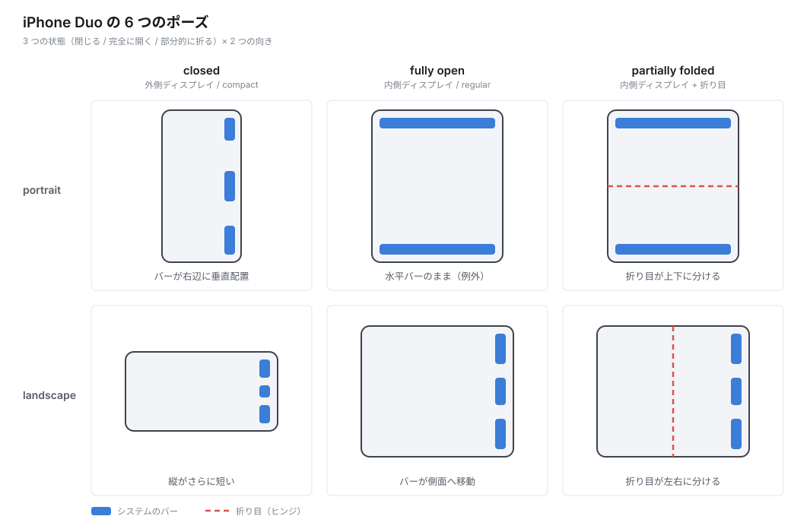

# iPhone Duo の基礎

## まず前提 — 「2 台」ではなく「1 台」

iPhone Duo は 2 つの独立したディスプレイを持つ端末ではなく、**1 つの端末**として捉えます。開く操作は、アプリのウインドウを横に広げる**リサイズと同じ**です。実際、iOS 27 の Mac の iPhone ミラーリングでのリサイズと同じ仕組みが動いています。

閉じた状態で始めた作業を、開いてそのまま続けることが想定されています。そのため姿勢ごとに別々の UI を作るのではなく、まず size class による適応レイアウトを土台にし、そのうえで垂直バーなど Duo 固有の作法を重ねます。

## デバイスの構成

| | 外側ディスプレイ | 内側ディスプレイ |
| --- | --- | --- |
| 見える状態 | 閉じているとき | 開いているとき |
| アスペクト比 | 従来の iPhone より横長 | 大きい |

ヒンジと前面カメラの位置が従来機と異なります。前面カメラは外側・内側で別物です（詳細は [04-camera.md](04-camera.md)）。

## size class

`horizontal` だけでなく `vertical` も見ると 3 パターンです。

| 状態 | horizontal | vertical |
| --- | --- | --- |
| 外側ディスプレイ・縦向き | compact | regular |
| 外側ディスプレイ・横向き | compact | compact |
| 内側ディスプレイ | **regular** | **regular** |

**内側は向きによらず regular / regular** です。さらに内側では、宣言した supported interface orientations に従って回転しません（宣言自体は尊重されますが、結果としてアプリがスケーリングされます）。縦向きのみ対応のアプリでも内側では regular / regular になります。Split View マルチタスキングでも同様です。

外側ディスプレイの interface orientation は通常の iPhone と同じです。

### 向きではなく幅で判断する

内側で縦横のレイアウトを変えたい場合、向きは environment と trait から取れますが、**推奨されているのは向きではなく利用できる幅で判断する方法**です。iPad では横向きのまま幅の狭いウインドウを作れるため、向きと幅は一致しません。分割ビューのようなコンテナ側に幅判断を任せ、グリッドなどは実際の幅に合わせます。

## 3 つの状態と 6 つのポーズ

デザイン上考慮すべき状態は 3 つです。

- **closed** — 閉じていて外側ディスプレイを使う
- **fully open** — 完全に開いて内側ディスプレイを使う
- **partially folded** — 部分的に折った状態。本のように持つ、机に置く、テント型に立てる、といった使い方がある

この 3 状態に portrait / landscape の 2 向きを掛けて **6 つのポーズ**になります。アプリはこの 6 つすべてで基本機能が使える必要があります。

| # | ポーズ | 主な特徴 |
| --- | --- | --- |
| 1 | closed / portrait | 外側ディスプレイ。縦が短いのでバーが側面に寄る |
| 2 | closed / landscape | 外側ディスプレイ。さらに縦が短い |
| 3 | fully open / portrait | 内側ディスプレイ。**バーは従来どおり上下に残る** |
| 4 | fully open / landscape | 内側ディスプレイ。バーが側面に寄る |
| 5 | partially folded / portrait | 折り目が画面を上下に分ける |
| 6 | partially folded / landscape | 折り目が画面を左右に分ける。ヒンジ回避が効く |

## この 6 ポーズが効いてくる理由

従来の iPhone は「1 画面・実質 2 向き」でした。iPhone Duo では同じアプリが走ったまま画面サイズ・size class・safe area・バーの配置が切り替わります。そのため、

- 画面サイズを決め打ちしたレイアウト
- interface orientation での分岐
- `UIScreen.main` 参照
- user interface idiom からの推測

はいずれも壊れます。代わりに size class・layout margins・safe area を基準にした**自由にリサイズできるレイアウト**にするのが基本方針です。

## 優先順位

リソースが限られる場合、まず次の 2 つに集中するのが推奨されています。

1. **size class** に基づくレイアウト分岐
2. **layout margins と safe area insets** の正しい取り扱い（特に水平方向）

`ArrangementView` やヒンジ角度の取得といった新 API は、この土台の上に乗せる改善です。

## スケジュールと開発環境

| 項目 | 内容 |
| --- | --- |
| iPhone Duo 発売 | 2026-10-23、搭載 OS は iOS 27.1 |
| Xcode 27.1 | 2026 年 9 月中に提供。Duo 対応 SDK と、**姿勢と向きを扱える新しい Device Hub** を含む |
| Xcode 27.2 | 27.2 の OS とともにベータ提供中 |
| デザインリソース | Apple Design Resources に iOS/iPadOS 27 UI Kit（Figma・Sketch）と iPhone Duo のベゼル（Photoshop・PNG） |

フル対応には **iOS 27.1 SDK** でのビルドが必要です。

| ビルドに使う Xcode | 外側ディスプレイ | 内側ディスプレイ |
| --- | --- | --- |
| Xcode 26 | iPhone mini に近い比率、垂直バーが来る側に黒帯 | 同じ比率で中央表示、両側に黒帯。拡大表示はできるが**姿勢の変化には反応しない** |
| Xcode 27（リサイズ対応済み） | — | ほぼ全体を使うが、ステータスバーの下の**側面**に黒帯 |
| Xcode 27.1 | 全画面 | 全画面 |

表示のされ方から、どの SDK でビルドされたかが分かります。

なお **iOS 27 SDK でリンクした時点でリサイズ対応が有効になり、Xcode 27 で従来の表示のまま据え置く方法はない**と回答されています。`UIRequiresFullScreen` は当面尊重されますが、開閉によるリサイズは発生し、ドキュメント上すでに非推奨扱いです。

Apple 側も準備期間が短いことを認めており、発売日にはベストプラクティスに沿った対応を出して後から改善を重ねる進め方が案内されています。

出典は [90-sources.md](90-sources.md) を参照してください。
