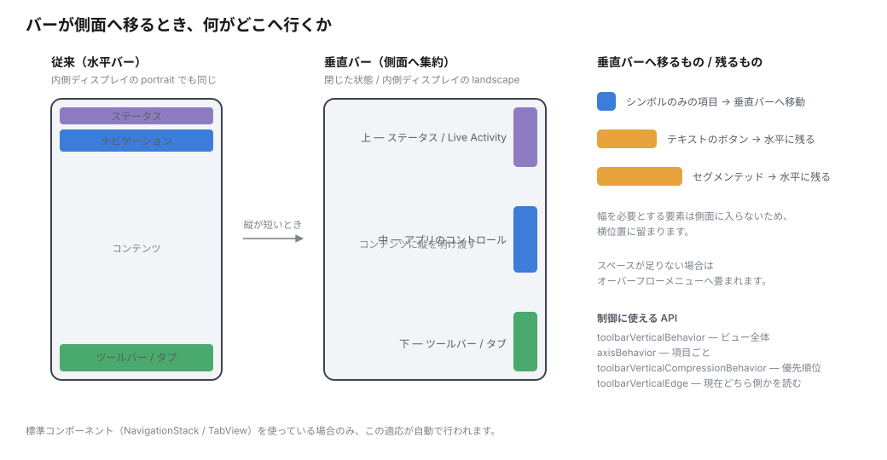
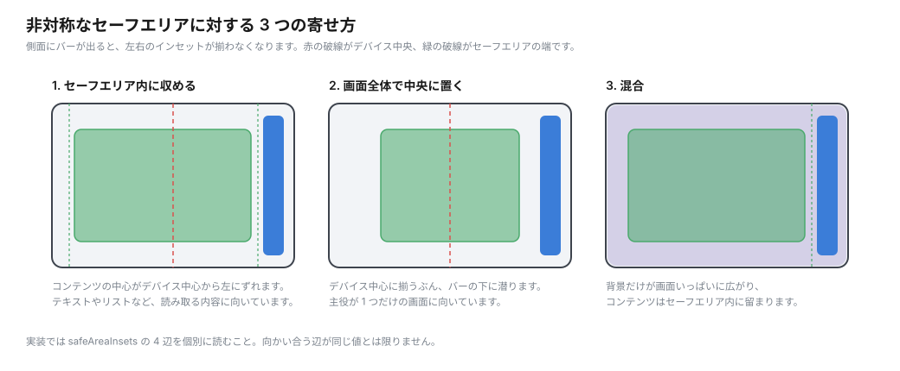

# デザイン原則

Apple の "Design for iPhone Duo" で示された原則を、実装判断に使える形に整理したものです。

## 原則 1 — コントロールは側面へ寄る

閉じた状態や内側ディスプレイの landscape では縦方向が短くなります。そこでシステムは、従来上下にあったナビゲーションバー・ツールバー・タブバーを**画面の側面に垂直配置**します。これによりコンテンツ用の縦方向のスペースが確保されます。



垂直バーの構成は上から順に次のとおりです。

1. **上** — Live Activity とステータスバーの情報
2. **中央** — ナビゲーション項目などのアプリのコントロール
3. **下** — ツールバー項目とタブバー項目

### 例外

- **内側ディスプレイの portrait**（fully open / partially folded の両方）では従来どおり水平バーが維持されます
- テキストラベルのボタンやセグメンテッドコントロールなど**横幅を要する要素は水平位置に留まります**。垂直バーに移るのはシンボルのみの項目です
- スペースが足りない場合はオーバーフローメニューに畳まれます

### 実装上の含意

この挙動を自動で得るには `UINavigationController` / `UITabBarController`（SwiftUI なら `NavigationStack` / `TabView`）といった標準コンポーネントを使う必要があります。自前で組んだバーはこの適応を受けられません。

## 原則 2 — 折り目を避けるのは「システムコンポーネント」

部分的に折った状態では画面中央が見づらく、触りづらくなります。ただし**何もかもを折り目から逃がすわけではありません**。

> この移動が組み込まれているのは対応するシステムコンポーネントであり、**スクロール可能なコンテンツは湾曲領域を避ける必要がありません**。

自動的に折り目を避けるのは、資料で名前が挙がっている範囲では次のものです。

- シート
- アラート
- コンテキストメニュー
- ツールバーボタン

分割ビューのような大きなコンポーネントは、列幅とマージンを内側ディスプレイの対称性に合わせて調整します。`NavigationSplitView` / `UISplitViewController` を使っていれば、本のように部分的に折ったとき分割が 50/50 へ自動調整されます。

一方で、長い本文やリストのようなスクロールコンテンツは折り目をまたいで構いません。レイアウトを能動的に組み替えるのは次のような場合です。

- リマインダーアプリのように、リストを折り目の左右へ振り分けたいとき
- 折った portrait で「メディアを上半分、コントロールを下半分」に分離したいとき

自前のオーバーレイを折り目から外したい場合は reserved regions を使います。

### 予約領域は 3 種類ある

API 上は `.occlusion` と `.division` の 2 種類ですが、HIG の概念整理では 3 つで、**存在する条件が違います**。

| 領域 | API の kind | 存在する条件 |
| --- | --- | --- |
| 外側ディスプレイの前面カメラ | `.occlusion` | **常に存在**。Live Activities では Dynamic Island へ広がる |
| 内側ディスプレイの前面カメラ | `.occlusion` | **カメラが作動しているときだけ** |
| 折り目 | `.division` | 部分的に開いているときに現れ、内側ディスプレイを分割する |

折り目の領域は、平らな状態では**非アクティブで幅がゼロ**になります。領域取得 API は既定でアクティブな領域だけを返すため、非アクティブも含めたい場合に `.includeInactive` を渡します。その用途として資料が挙げているのは「**折り目の状態によらずグリッドの列数を偶数に保つ**」判断です。

### レイアウトの指針

- 折れたときに自動で適応するレイアウトコンテナを優先する
- グリッド状のレイアウトでは**列数を偶数に**して、コンテンツがきれいに分かれるようにする
- システムが自動で移動しないものは、reserved region の API で重要な要素を中央から外す
- 連続スクロールするコンテンツを領域間で移動させない

なお、移動量や角度などの具体的な条件を制御する API は公開されていません。

## 原則 3 — 非対称な safe area を前提にする

コントロールが側面に寄る結果、**水平方向の safe area inset が目立つようになります**。しかも向かい合う辺のインセットが等しいとは限りません。左右・上下それぞれを個別に扱ってください。



コンテンツの寄せ方には 3 つのパターンがあります。

| パターン | 内容 | 向いているもの |
| --- | --- | --- |
| safe area 内に収める | 側面のコントロールを避けて配置 | テキスト、リスト |
| 画面全体で中央に置く | safe area を無視してデバイス中央に揃える | 単一の主役コンテンツ |
| 混合 | 背景は画面全体、コンテンツは safe area 内 | 背景付きのメディア |

## 原則 4 — 特定のポーズに機能を縛らない

「このポーズでしか使えない機能」を作らないことが求められます。ヒンジ角度や折りたたみ状態は**体験を良くする味付け**として使い、必須の操作経路にしないでください。

### 「すべての姿勢に合わせて設計する」のは失敗例

Group Lab では、**姿勢ごとに作り込もうとすること自体が設計上の失敗例として名指しされています**。Apple のデザインチーム自身が当初その方針を取り、基本を押さえれば足りると分かった、という経緯が語られました。

姿勢ごとに全く異なる UI を用意すると、遷移が問題になります。Apple 内では「**遷移を滑らかにアニメーションさせられるか**」を基準にパターンを決めたそうです。

一歩踏み込む良い例として挙がったのは、**卓上に置いたときに操作部を下側へ移す動画・ポッドキャストプレーヤー**です。TV アプリでは再生中に部分的に折ると、動画と操作部が滑るように分かれます（`ArrangementView` でこの動きが得られます）。

AR など没入型の全画面アプリは通常どおり作ってステータスバーを隠せばよく、垂直コントロールを使う必要はありません。

### 操作部の位置をそろえる理由

閉じた状態と開いた横向きで操作部の位置をそろえるのは、**手の位置の記憶**のためです。開いた縦向きは両手持ちが多いので、そこではレイアウトを変えます。

外側と内側でアプリの**階層**を変えることは避けてください。

### 要素を移動させるときのルール

- 独立して適応できる要素は単独で移動し、連携する要素は関係を保つため一緒に移動する
- 移動元との視覚的関係を弱める**過度な移動は避ける**
- **記事・フィード・文書・リストなどの連続スクロールコンテンツは領域間で移動させない**（スクロールで適応するため、移動は連続性を妨げます）
- 移動先は要素の目的と端末の使用状態に合わせる

姿勢ごとの例としては、本のように折った状態ではアラートを trailing 側へ、卓上に立てた状態では上側を離れて見るコンテンツ、下側を操作コントロールの配置先にする、という形が挙げられています。

## 原則 5 — 分岐でビュー階層を作り替えない

size class で `if` を切り、分岐ごとに別のコンテナを使っている SwiftUI のコードは、切り替わった時点で片方のビュー階層が捨てられます。状態を上位に持ち上げていなければ失われます。

```swift
// 避ける: 分岐ごとに別のコンテナ
if horizontalSizeClass == .regular {
    NavigationSplitView { ... } detail: { ... }
} else {
    NavigationStack { ... }
}
```

iPad のリサイズでも起きていた問題ですが、iPhone Duo では**内側ディスプレイから閉じるたびに**表面化します。`NavigationSplitView` 単体や `ArrangementView` で吸収できないか、分岐そのものをやめられないかを先に検討してください。`ArrangementView` は iPhone Duo 専用ではなく、折りたたまない端末でも幅に応じて 2 列と単一ビューを切り替えるので、`HStack` / `VStack` / `ZStack` を `if` で切り替える書き方から離れる手段になります。

## 姿勢の作り込みはほどほどに

- 部分的に折った状態が主要な使い方になるのか、姿勢を変える途中の一瞬にすぎないのかは **Apple 内でも結論が出ていません**（Group Lab）。発売直後から作り込みすぎないこと
- 姿勢を判定して分岐する前に、arrangement view と reserved regions で足りないか検討する。Apple の音楽アプリは arrangement view を使い、分割位置を知るために reserved region を参照しています
- 卓上に立てる姿勢は、**カメラ側を下にしても外側ディスプレイを下にしても同じ体験**になるべきです
- 収益に直結するボタン（購入・カートへ追加・無料トライアル開始）が折り目に重なる構成なら、reserved regions で折り目がアクティブかを見て置き場所を選び直します。アラートのようなシステムコンポーネントは自動で動きますが、コンテンツ領域に置いた自前の部品は動きません

### ゲーム

HIG の Best practices にこうあります。

> **Make your game playable in every device pose.** You can choose to lock to either portrait or landscape orientation, but be sure to fill the screen as the device pose changes. When resizing, keep text and control sizes as consistent as possible. Prefer changing the aspect ratio over letterboxing or pillarboxing in games; if you can't avoid letterboxing or pillarboxing, add artwork to the padding area to help the experience feel full screen.

## アクセシビリティ

- **「透明度を下げる」を有効にすると、垂直バーの背後に不透明な矩形が描かれます。** この矩形はコンテンツに直接接しないよう垂直バーの safe area より少し狭く作られています。**この設定を有効にした状態で表示を確認すること**が勧められました
- **VoiceOver は 2 つのディスプレイで同時に動作します**
- 内側ディスプレイは Dynamic Type の大きいサイズを使う利用者に効果が大きいため、readable content guide を使った対応が効きます

## やってはいけないことリスト

- interface orientation で分岐する
- `UIScreen.main` を参照する
- **固定幅、ブレークポイント、特定の画面に結び付いた寸法を使う**
- user interface idiom からデバイスを推測する
- 向かい合う safe area inset が等しいと仮定する

### Apple の原文

3 つの公式資料が同じことを言っています。

**Tech Talk「[Design for iPhone Duo](https://developer.apple.com/videos/play/tech-talks/111466/)」（4:08）** — breakpoint を名指ししているのはこれです。

> People will use iPhone Duo in many different poses, and you'll want your app to look great across all of them. But that doesn't mean designing a custom layout for each pose. Instead, focus on two size classes: compact width on the outer display and regular width on the inner display. **Avoid fixed widths, breakpoints, or any metrics tied to a specific screen. Instead, always target these size classes.** Build your layouts with layout margins and horizontal safe area insets.

**HIG「[Designing for iPhone Duo](https://developer.apple.com/design/human-interface-guidelines/designing-for-iphone-duo)」** の Best practices:

> **Build your app to resize.** Because the device has two displays and supports a wide range of poses and Split View multitasking, your app can appear at many different sizes. Use size classes, layout margins, and safe area insets to lay out controls and content. **Avoid fixed widths and display-specific dependencies.**

Dynamic layouts の項でも繰り返されます。

> As with all iOS devices, build your layouts with layout margins and safe area insets, and **steer clear of fixed widths or anything tied to a specific display**.

**開発者ガイド「[Preparing your app for iPhone Duo](https://developer.apple.com/documentation/technologyoverviews/preparing-your-app-for-iphone-duo)」**:

> Size your views relative to their container rather than to fixed iPhone dimensions. Make layout calculations based on your scene or containing view's bounds rather than screen dimensions.

HIG と開発者ガイドのページには breakpoint という語は出てきませんが、Tech Talk で明示されています。**レイアウトの大枠は自前の幅のしきい値ではなく、size class（compact / regular の 2 つ）で切り替える**、というのが Apple の指針です。

### 「600pt 以上なら 6 列、未満なら 3 列」はどうか

自前の幅のしきい値で段階を切り替えているので、Tech Talk が避けるよう言っている breakpoint に当たります。代わりの書き方は 2 つです。

- 大枠の切り替えなら size class で分岐する（外側 = compact、内側 = regular）
- グリッドの列数なら、しきい値を持たずにコンテナの実幅に合わせる（例: `GridItem(.adaptive(minimum:))` のようにセルの最小幅から列数を導く）

グリッドを実際の幅に合わせるという指針は Group Lab での回答です（解説記事経由で、公式の文字資料では未確認）。App Store アプリや Health アプリが横向き 2 列・縦向き 1 列に切り替える例が挙げられています。

どちらの場合も、幅は `UIScreen` からではなく**コンテナから読む**必要があります。垂直バーが 84pt を占めるため、画面幅と実際に使える幅は常にずれます。

### グリッドは偶数列を選ぶ

HIG には別の指針として次が書かれています。

> **In a grid-style layout, prefer an even number of columns so content divides cleanly.**

折り目で左右に分かれたときにきれいに割れるためです。3 列のような奇数列はこの指針から外れます（`prefer` なので強制ではありません）。`.adaptive` で列数を導く場合は奇数になりうるので、偶数にそろえたいなら実幅から求めた列数を偶数に丸める、といった調整が要ります（これは解釈です）。

### 折りへの追従のほうが重要

> **Adapt your layout when the device folds.** Prefer a layout container that adapts automatically, like the split view in Notes that adjusts the width of each pane to stay clearly visible as the device folds.

> **Avoid extreme layout changes as people fold the device.** Move only what's necessary to keep elements visible and easy to tap. Controls that disappear or shift dramatically are harder to find and track, so favor small adjustments over rearrangement.

列数のしきい値より、折ったときに自動で適応するコンテナを選ぶことと、変化を最小限にすることのほうが重視されています。
