# API リファレンス（iOS 27.1 SDK 実測）

`iPhoneOS27.1.sdk`（Xcode 27.1 Beta）の `.swiftinterface` とヘッダから抽出した内容です。ここに載せている API 名、引数ラベル、availability は、すべて SDK を直接引いて確認しました。

カメラ関連は [04-camera.md](04-camera.md) に分けています。

> SwiftUI 側の API は、`SwiftUICore` モジュールにあるものと `SwiftUI` モジュールにあるものが混在しています。`SwiftUI` が `SwiftUICore` を再エクスポートするので、利用側は `import SwiftUI` だけで足ります。ただし SDK を grep するときは、両方を見る必要があります。

## 実測の前提と読み方

各 API の「実測」は、次の環境で得た値です。**実機では確認していません。**

| 項目 | 内容 |
| --- | --- |
| Xcode | 27.1 Beta（27A9269） |
| 端末 | iPhone Duo シミュレータ（iOS 27.1） |
| 姿勢の操作 | DeviceHub の下部バーにある姿勢ボタンと回転ボタン（[03-verification.md](03-verification.md)） |
| 測定に使ったアプリ | このリポジトリの Lab（[03-verification.md](03-verification.md) に一覧） |

### 姿勢の呼び方

| 姿勢 | 使うディスプレイ | 画面の大きさ（pt） | 作り方 |
| --- | --- | --- | --- |
| closed / portrait | 外側 | 466 × 678 | 姿勢ボタン（電話型） |
| closed / landscape | 外側 | 678 × 466 | 回転。**バーが右に出る向きと、左に出る向きがあります** |
| open / portrait | 内側 | 669 × 951 | 姿勢ボタン（平らな画面）で開き、portrait にする |
| open / landscape | 内側 | 951 × 669 | 同上で landscape にする |
| partial / portrait | 内側 | 669 × 951 | 姿勢ボタン（本型）。ヒンジ角度は約 128°（127.5〜128.0°） |
| partial / landscape | 内側 | 951 × 669 | 同上で landscape にする |

closed / landscape 以外で、バーが左に出る向きは測っていません。左右が反転するだけだと思われますが、未確認です。

### 値の読み方

- 単位は pt です。safe area と margins は **top / bottom / leading / trailing** の順です
- SwiftUI の `GeometryProxy` で得る座標は、safe area の内側（ナビゲーションバーの下）が原点です。UIKit の view の座標は、画面の左上が原点です。同じ領域でも、`y` の値が safe area の top（この Lab では 82pt）だけずれます
- 「バー」は、垂直バー（側面に寄ったナビゲーションバー・ツールバー・タブバー）のことです。幅は 84pt です

### 6 姿勢の基本値

`NavigationStack` の中に置いた画面で読んだ値です。上部の 82pt は、ステータスバーとナビゲーションバーの分です。

| 姿勢 | `GeometryReader` の size | size class（h / v） | `toolbarVerticalEdge` | safe area |
| --- | --- | --- | --- | --- |
| closed / portrait | 382 × 562 | compact / regular | trailing | 82 / 34 / 0 / **84** |
| closed / landscape（バーが右） | 594 × 350 | compact / compact | trailing | 82 / 34 / 0 / **84** |
| closed / landscape（バーが左） | 594 × 350 | compact / compact | leading | 82 / 34 / **84** / 0 |
| open / portrait | 669 × 835 | regular / regular | nil | 82 / 34 / 0 / 0 |
| open / landscape | 867 × 553 | regular / regular | trailing | 82 / 34 / 0 / **84** |
| partial / portrait | 669 × 835 | regular / regular | nil | 82 / 34 / 0 / 0 |
| partial / landscape | 867 × 553 | regular / regular | trailing | 82 / 34 / 0 / **84** |

- 垂直バーが出るのは、closed の 2 向きと、内側の landscape です。内側の portrait には出ません
- バーがある辺の safe area は 84pt になり、反対側は 0 です。左右の値を足しても、姿勢によらず同じ値にはなりません

## API の抽象度には層がある

折り目まわりの API は、上の層ほど抽象度が高く、下の層ほど低レベルです。上の層で足りるなら、下の層には降りないのが原則です。ヒンジ角度から自前で計算する前に、arrangement や reserved regions で済まないかを先に検討してください。

| 層 | 何をするか |
| --- | --- |
| システムコンポーネント | 何もしなくても折り目に合わせて配置が変わる（シート、アラート、メニュー、ポップオーバー、分割ビュー） |
| arrangement view | 折り目に合わせて 2 つのビューを配置するコンテナ |
| reserved regions | 領域の矩形を取得して自前で避ける |
| ヒンジ | 角度そのもの。インタラクションやエフェクト向け |

資料では、用語が次の 3 つに整理されています。

| 用語 | 位置づけ |
| --- | --- |
| **displacement**（要素の移動） | 設計パターン。専用 API はありません |
| **arrangement**（2 ビューの配置） | API。`ArrangementView` など |
| **reserved regions**（確保された領域） | API。displacement を自前で実装するときに使う |

## 1. ArrangementView（iOS 27.1）

2 つのビューの配置を、折り目に合わせてシステムが自動で調整します。


```swift
@available(iOS 27.1, *)
struct ArrangementView<Primary: View, Secondary: View>: View {
    init(@ViewBuilder primary: () -> Primary, @ViewBuilder secondary: () -> Secondary)
}
```

```swift
ArrangementView {
    PlayerView()
} secondary: {
    UpNextView()
}
.arrangementViewStyle(.split)
```

システムは、ディスプレイのサイズ、向き、size class、縦横比、reserved regions、アクティブな division region を見て配置を決めます。

### スタイル

| スタイル | 型 | `axes(_:)` |
| --- | --- | --- |
| `.automatic` | `AutomaticArrangementViewStyle` | なし |
| `.split` | `SplitArrangementViewStyle` | あり |
| `.overlay` | `OverlayArrangementViewStyle` | あり |

```swift
func arrangementViewStyle(_ style: some ArrangementViewStyle) -> some View
func axes(_ axes: Axis.Set) -> SplitArrangementViewStyle

.arrangementViewStyle(.split.axes(.horizontal))
```

- `.split`: primary と secondary を左右（または上下）に分けます。分け方は姿勢で決まります。軸を制限でき、その軸で分けられない姿勢では、分けずに primary だけを出します（下の実測）
- `.overlay`: 通常は 2 つを重ねます。部分的に折った姿勢だけは、折り目を挟んで分けます。secondary を折りたたむこともできます（この点は実測していません）

移行の目安は、`HStack` / `VStack` なら `.split`、`ZStack` なら `.overlay` です。前景と背景の関係が明確なら overlay を選びます。主内容と詳細のどちらも隠したくないなら split を選びます。

### 実測: ペインの位置

青い primary と橙の secondary を入れた `ArrangementView` を、姿勢ごとに画面に出し、各ペインの範囲を画素から測りました。数値は pt で、**画面の左上が原点**です（UIKit の座標と同じです）。`GeometryReader` の座標にするには、y から safe area の top（この Lab では 82）を、x から safe area の leading（バーが左のときだけ 84）を引きます。

凡例です。**P** は primary、**S** は secondary、**単** は primary だけが全面に出て secondary は出ない状態、**重** は 2 つが全面で重なる状態です。

`.automatic` と `.split` は、全姿勢で同じ結果でした。

| 姿勢 | `.split`（`.automatic`） | `.split.axes(.vertical)` | `.split.axes(.horizontal)` |
| --- | --- | --- | --- |
| closed / portrait | P 上 y 82–363 / S 下 y 363–644 | 左と同じ | 単 |
| closed / landscape | 単 | 単 | 単 |
| open / portrait | P 上 y 82–500 / S 下 y 500–917 | 左と同じ | 単 |
| open / landscape | P 左 x 0–434 / S 右 x 434–867 | 単 | `.split` と同じ |
| partial / portrait | P 上 y 82–456 / S 下 y 496–917 | 左と同じ | 単 |
| partial / landscape | P 左 x 0–456 / S 右 x 496–867 | 単 | `.split` と同じ |

| 姿勢 | `.overlay` | `.overlay.axes(.vertical)` | `.overlay.axes(.horizontal)` |
| --- | --- | --- | --- |
| closed / portrait | 重 | 重 | 重 |
| closed / landscape | 重 | 重 | 重 |
| open / portrait | 重 | 重 | 重 |
| open / landscape | 重 | 重 | 重 |
| partial / portrait | **P 下** y 496–917 / **S 上** y 82–456 | `.overlay` と同じ | 重 |
| partial / landscape | **P 右** x 496–867 / **S 左** x 0–456 | 重 | `.overlay` と同じ |

読み取れることです。

- 折り目がある（partial）と、2 つのペインの間に **40pt の空き**ができます。折り目がない姿勢では、ちょうど半分ずつで、空きはありません
- `.split` は P が左（縦なら上）、S が右（縦なら下）です。`.overlay` が分かれるときは、逆になります。**S が左（縦なら上）、P が右（縦なら下）** です
- `axes` は、分ける向きを制限します。その姿勢で使えない軸を指定すると、分けずに primary だけを出します。`.overlay` の場合は重なったままです。portrait では `.vertical`（上下に分ける）だけ、landscape では `.horizontal`（左右に分ける）だけが効きました。折り目の有無は関係ありません
- closed / landscape は、compact / compact なので、`.split` でも分かれません
- `.overlay` を折り目のない姿勢で使うと、全面で重なります。分かれて見えるのは、partial のときだけです

closed / landscape は、バーが左に出る向きで測りました。バーが右に出る向きでは、x の範囲がバーの分だけ反対側にずれます（`x 0–594`）。

| closed / portrait | closed / landscape（バーが左） | open / portrait |
| --- | --- | --- |
| 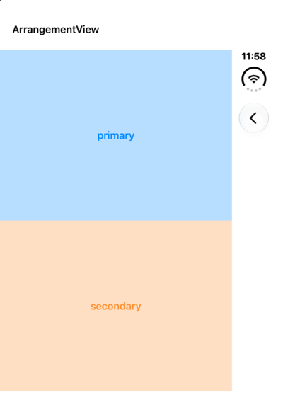 | 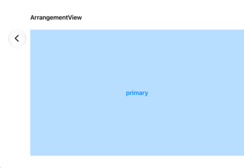 | 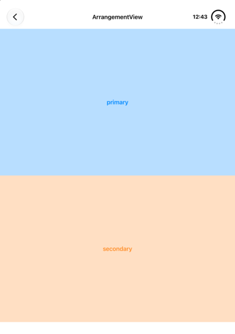 |

| open / landscape | partial / portrait | partial / landscape |
| --- | --- | --- |
| 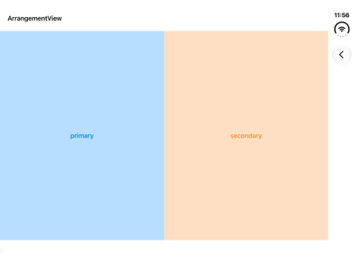 | 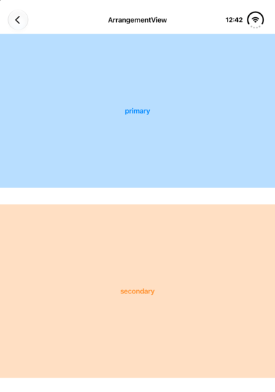 | 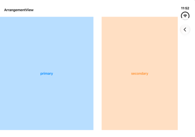 |

上の 6 枚は `.split` です。同じ partial / landscape で、スタイルを変えたものです。

| `.split` | `.split.axes(.vertical)` | `.overlay` | `.overlay.axes(.vertical)` |
| --- | --- | --- | --- |
|  | 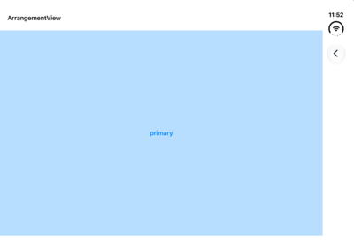 | 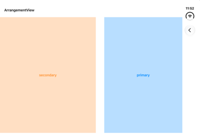 | 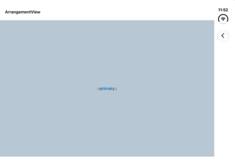 |

### レイアウトの制御（記事本文のコード例には出てこない）

```swift
@available(iOS 27.1, *)
func splitArrangementLayoutRatio(_ ratio: ...) -> some View
func splitArrangementLayoutRatio(minHorizontal: ..., ...) -> some View
func splitArrangementLayoutSize(minWidth: ..., ...) -> some View
func splitArrangementFixedLayoutSize(horizontal: ..., vertical: ...) -> some View
func overlayArrangementEdge(_ edge: ...) -> some View
```

overlay の重なり順は、環境値から読めます。値が 0 より大きいかどうかで、縮小表示と展開表示を切り替える使い方が想定されています。

```swift
@available(iOS 27.1, *)
extension EnvironmentValues {
    var overlayArrangementZIndex: Int { get set }
}
```

UIKit 側では `state(for:)` が返す `UIArrangementViewState` の `zIndex` が対応します。

### 入れ子の制約

`ArrangementView` はナビゲーションの仕組みを持たないので、次の 2 つは避けます。

- `ArrangementView` の中に、`NavigationSplitView` などのナビゲーションコンテナを置かない
- `List` や `ScrollView` などのスクロールコンテナの中に、`ArrangementView` を置かない

ナビゲーションは `ArrangementView` の外側に置きます。

## 2. ReservedRegion（iOS 27.1）

折り目やカメラが占める領域を問い合わせます。`GeometryProxy` のメソッドです。

```swift
@available(iOS 27.1, *)
extension GeometryProxy {
    func reservedRegions(
        kind: ReservedRegion.Kind,
        options: ReservedRegion.QueryOptions = [],
        layoutDirectionBehavior: LayoutDirectionBehavior = .mirrors
    ) -> [ReservedRegion]
}

@available(iOS 27.1, *)
struct ReservedRegion: Equatable, Hashable, Identifiable, Sendable {
    var id: ReservedRegion.ID
    var kind: ReservedRegion.Kind
    var frame: CGRect
    var margins: EdgeInsets
    var isActive: Bool
}
```

- `ReservedRegion.Kind`: `.division`（折り目）と `.occlusion`（カメラ）の 2 つだけです。struct の static プロパティで、enum ではありません
- `ReservedRegion.QueryOptions`: `OptionSet` で、値は `.includeInactive` だけです

```swift
GeometryReader { proxy in
    let folds = proxy.reservedRegions(kind: .division)
    let camera = proxy.reservedRegions(kind: .occlusion, options: [.includeInactive])
}
```

アクティブと非アクティブの条件は、[01-design-principles.md](01-design-principles.md) の「予約領域は 3 種類ある」を参照してください。外側カメラは常にアクティブです。内側カメラは、カメラが作動しているときだけアクティブになるとされています（実測できていません）。折り目は、open では非アクティブで実体の幅が 0、closed では存在しません。partial だけがアクティブです（次の実測）。

UIKit 側は `UIView.reservedRegions(kind:options:)` で、`layoutDirectionBehavior` 引数はありません。`UIView._boundaryLayoutRegions` は iOS 27.0 で deprecated になりました。代わりに `reservedRegions(kind: .division)` を使うよう明記されています。

### 実測: 領域の位置と margins

`frame` は、**margins を含んだ**矩形です（UIKit のヘッダに "The rect of the region in the view's coordinate space, including the margins" とあります）。`margins` は、その中にある「操作できる内容を避けるための余白」です。避けるべき実体は、`frame` から `margins` を引いた矩形になります。

折り目で確かめると、こうなります。partial / landscape の `frame` は幅 40pt で、`margins` は左右 20pt ずつです。実体の幅は 0 で、折り目の両側に 20pt ずつの余白が付いた形です。折り目を避けるなら、40pt 全体を避けます。

下の表は `.includeInactive` を付けて取った、全件です。SwiftUI の `GeometryProxy` の座標で、`(x, y) 幅×高さ` の順です。`m[]` は margins（top / bottom / leading / trailing）、**A** はアクティブ、**非**は非アクティブを表します。

| 姿勢 | `.division`（折り目） | `.occlusion`（カメラなど） |
| --- | --- | --- |
| closed / portrait | 0 件 | **A** (399.7, −52.7) 37×37 / **A** (382, −82) 84×170 |
| closed / landscape（バーが右） | 0 件 | **A** (611.7, 317.7) 37×37 / **A** (594, 302) 84×82 |
| closed / landscape（バーが左） | 0 件 | **A** (−54.7, −52.7) 37×37 / **A** (−84, −82) 84×82 |
| open / portrait | 非 (0, 373.5) 669×40 m[20/20/0/0] | 非 (21, 133.7) 37×58 / **A** (535, −82) 134×82 |
| open / landscape | 非 (455.5, −82) 40×669 m[0/0/20/20] | 非 (677.3, −61) 58×37 / **A** (867, −82) 84×120 |
| partial / portrait | **A** (0, 373.5) 669×40 m[20/20/0/0] | 非 (21, 133.7) 37×58 / **A** (535, −82) 134×82 |
| partial / landscape | **A** (455.5, −82) 40×669 m[0/0/20/20] | 非 (677.3, −61) 58×37 / **A** (867, −82) 84×120 |

`.occlusion` の `margins` は、全件で 0 です。

読み取れることです。

- **折り目（`.division`）は、partial のときだけアクティブです。** open では非アクティブのまま存在し、`.includeInactive` を付けないと返りません。closed では、`.includeInactive` を付けても 0 件です
- 折り目の向きは、画面の向きで決まります。portrait では横帯（幅 = 画面幅、高さ 40pt）、landscape では縦帯（幅 40pt、高さ = 画面高）です。`frame` の `y`（landscape では `x`）が、折り目の位置です
- `.occlusion` は closed で 2 件返ります。どちらもアクティブです。1 つは 37×37 のカメラで、もう 1 つは、それを含む幅 84pt の領域です。後者が何のための領域かは、実測では分かりません（[01-design-principles.md](01-design-principles.md) は、Live Activity で Dynamic Island へ広がる領域と説明しています）
- open と partial では、アクティブな `.occlusion` が 1 件です。画像では、時計とアイコンが出る位置に当たります。portrait では 134×82、landscape では 84×120 です
- 内側の前面カメラは、open と partial で**非アクティブ**の領域として 1 件現れます。portrait では 37×58、landscape では 58×37 です。このシミュレータにはカメラが無く、動作中の状態は作れません。アクティブになる条件は、実機で確かめる必要があります（[04-camera.md](04-camera.md)）
- 内側カメラの領域の位置は、端末の向きで変わります（次の節）。**位置を決め打ちせず、毎回 `reservedRegions` を読んでください**

**回転ボタンで通る向きによる違い**です。内側ディスプレイでは、回転ボタンを押すと 4 つの向きを順に通ります。**180° 離れた 2 つの向きの間で、内側カメラの領域の位置が 180° 回ります。** 上の表と、この文書の画像は、すべて「カメラの領域が画面の上半分にある向き」で統一しています。

| 向き | カメラの領域（SwiftUI の座標） | 備考 |
| --- | --- | --- |
| portrait・カメラの領域が上半分（この文書の表と画像） | (21, 133.7) 37×58 | 画面の左上寄り |
| portrait・もう一方の向き | (611, 595.3) 37×58 | 画面の右下寄り |
| landscape・カメラの領域が上半分（この文書の表と画像） | (677.3, −61) 58×37 | 画面の上端の、右寄り |
| landscape・もう一方の向き | (215.7, 529) 58×37 | 画面の下端の、左寄り |

- どちらの向きでも、DeviceHub 上で文字は読める向きでした。**見た目の向きだけでは、どちらの向きか分かりません。** 向きを見分けるには、この領域の位置を見ます
- そのほかの値（safe area、size class、`.division`、アクティブな `.occlusion` など）は、この 2 つの向きで変わりませんでした。変わったのは、内側カメラの領域の位置だけです
- 外側ディスプレイの closed / landscape にも、2 つの向きがあります。バーが左に出る向きでは、カメラの領域が画面の左上に、バーが右に出る向きでは、右下にあります。どちらの向きでも測りました
- 向きが上下逆になった状態（closed / portrait でバーが左に出て、文字が逆さまになる向き）も、回転ボタンで通ります。この文書の値と画像には、その状態のものは含めていません

SwiftUI と UIKit は、同じ矩形を返します。座標の原点だけが違い、UIKit の値は次のように変換できます。

- UIKit の `y` = SwiftUI の `y` + safe area の top（この Lab では 82）
- UIKit の `x` = SwiftUI の `x` + safe area の leading（バーが左のときだけ 84、それ以外は 0）

| closed / portrait | closed / landscape（バーが左） | open / portrait |
| --- | --- | --- |
| 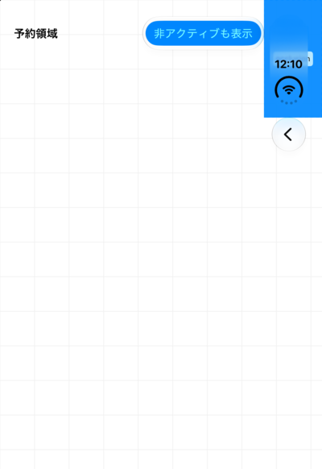 | 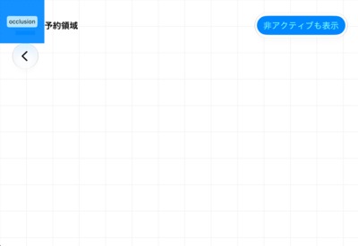 | 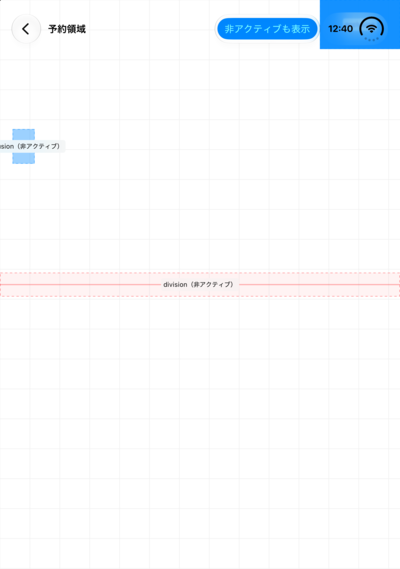 |

| open / landscape | partial / portrait | partial / landscape |
| --- | --- | --- |
| 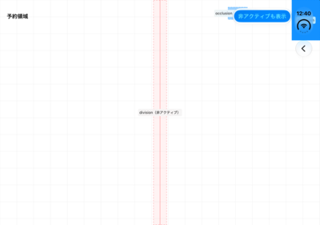 | 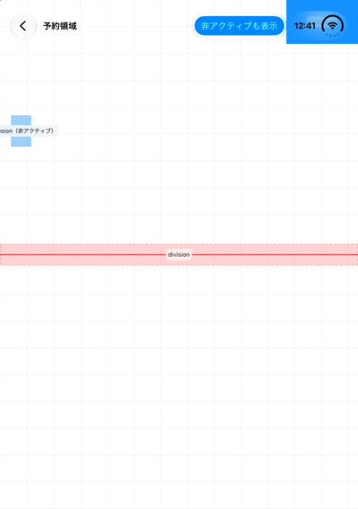 | 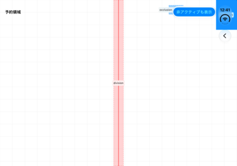 |

画像は `ReservedRegionsLab` で、`.includeInactive` を付けて描いたものです。濃い色が実体、薄い色と破線が `frame` 全体（margins を含む）、「非アクティブ」と書いた領域は薄く描いてあります。

## 3. ヒンジ（iOS 27.1）

インタラクションやエフェクト向けの API です。レイアウトには、arrangement と region の API を使ってください。

```swift
@available(iOS 27.1, *)
extension View {
    func onHingeChange(
        isEnabled: Bool = true,
        _ action: @escaping (_ oldContext: DeviceHingeContext, _ newContext: DeviceHingeContext) -> Void
    ) -> some View
}

@available(iOS 27.1, *)
struct DeviceHinge: Hashable, Sendable {
    var status: DeviceHinge.Status
    var angle: Angle                 // SwiftUI は Angle。UIKit は CGFloat で、単位は radians
}

@available(iOS 27.1, *)
struct DeviceHingeContext: Equatable, Sendable {
    var hinge: DeviceHinge?          // ヒンジのないデバイスでは nil
}
```

`DeviceHinge.Status` は `.closed` / `.partiallyOpen` / `.fullyOpen` の 3 つです。

### 補足

型名は `DeviceHinge` / `DeviceHingeContext` です（`Hinge` という型はありません）。SwiftUI 側の `Status` に `unknown` はありません。`.unknown = 0` があるのは、UIKit の `UIHingeStatus` だけです。ヒンジ状態を読む EnvironmentValues は存在せず、取得手段は `onHingeChange` だけです。

UIKit 側は `UIHinge`（`status` / `angle: CGFloat`。**単位は radians** です）と `UIHingeInteraction`（`init(updateHandler:)`、`isEnabled`、`Update.hinge: UIHinge?`）です。

### 実測: 通知の中身と、状態が切り替わる角度

姿勢ボタンで端末を動かしながら、`onHingeChange` に届く通知をすべて記録しました。

**最初の通知**は、ビューが現れた直後に 1 回届きます。`oldContext.hinge` は nil で、`newContext.hinge` に現在の値が入ります。

| 姿勢 | 最初の通知 |
| --- | --- |
| closed | `nil → closed 0.0°` |
| partial | `nil → partiallyOpen 127.8°`（回により 127.5° や 128.0°） |
| open | `nil → fullyOpen 180.0°` |

UIKit の `UIHingeInteraction` も同じです。ヘッダに、"The handler is invoked with the initial hinge state, and again whenever there is an update" とあります。

**姿勢ボタンで動かすと、角度は途中の値を通りながら変わります。** closed から open へ動かしたときの通知は、次の 13 件でした。

```
nil → closed 0.0°
closed 0.0° → closed 5.0°
closed 5.0° → partiallyOpen 43.2°
partiallyOpen 43.2° → 131.1° → 144.7° → 161.7° → 163.4° → 167.3° → 170.0° → 170.7° → 173.8° → 174.7°
partiallyOpen 174.7° → fullyOpen 180.0°
```

通知の間隔は、1° 台から 90° 近くまでまちまちです（1.1° 刻みの箇所も、`43.2° → 131.1°` のように 88° 飛ぶ箇所もありました）。UIKit のヘッダにも、"The rate and granularity of angle updates are system policy and can change based on system state, so don't depend on a particular update frequency or precision" とあります。**角度の細かさや頻度に依存しないでください。**

**`status` が切り替わる角度は、動かす向きで違いました。** 記録した切り替わりを並べます。

| 動かし方 | 切り替わり |
| --- | --- |
| 開く（closed → partial） | `closed 16.1° → partiallyOpen 22.6°`、`closed 12.4° → partiallyOpen 25.9°`、`closed 9.2° → partiallyOpen 44.2°`、`closed 19.4° → partiallyOpen 48.8°` |
| 開く（closed → open） | `closed 5.0° → partiallyOpen 43.2°`、`partiallyOpen 174.7° → fullyOpen 180.0°` |
| 閉じる（open → closed） | `fullyOpen 180.0° → partiallyOpen 159.6°`、**`partiallyOpen 93.5° → closed 82.7°`** |

- 開いていく途中では、closed は 19.4° まで、partiallyOpen は 22.6° から届きました。閉じていく途中では、partiallyOpen は 93.5° まで、closed は 82.7° から届きました
- 同じ角度でも、動かす向きで `status` が違います。開いている途中は 22.6° で partiallyOpen になるのに、閉じている途中は 82.7° でも closed でした。**角度から `status` を自分で計算せず、`status` を使ってください。** UIKit のヘッダも "prefer `status` over the angle" と勧めています
- `fullyOpen` になるのは、180.0° のときだけでした。174.7° や 174.8° でも `partiallyOpen` です
- これはシミュレータの遷移アニメーション中の値です。実機で同じになるかは確認していません

**同じ値の通知が、続けて届くことがあります。** partial へ動かしたとき、角度が止まったあとに、まったく同じ角度の通知が 9 回続けて届きました。`onHingeChange` のクロージャの中で `@State` を更新しない場合でも、同じでした。角度を 4 桁まで記録して確かめると、9 回とも `127.77777862548827°` で、値は一致していました。

- open へ動かしたとき（180.0° でぴったり止まる動き）は、同じ値の繰り返しは見られませんでした
- 通知が届く回数は、回ごとに違いました（5 回、9 回）。**通知が重複することを前提に、値が前回と同じなら処理を省く書き方にしてください**

**UIKit の角度は radians です。** `UIHinge.angle` はヘッダに "in radians" とあり、実測でも partial は 2.2（= 127.8°）、open は 3.1（≒ π、180°）でした。度にするには `angle * 180 / .pi` とします。SwiftUI の `Angle` は、`.degrees` で度を読めます。

## 4. ツールバーの垂直配置

### toolbarVerticalBehavior（iOS 27.1）

ビュー全体で、垂直バーを使うかどうかを決めます。

```swift
@available(iOS 27.1, *)
func toolbarVerticalBehavior(_ behavior: ToolbarVerticalBehavior) -> some View

struct ToolbarVerticalBehavior: Hashable, Sendable {
    static let automatic: ToolbarVerticalBehavior
    static let disabled: ToolbarVerticalBehavior
}
```

値は 2 つだけです。UIKit では、ビューコントローラの `preferredVerticalBarBehavior` を override します。

### ToolbarItemAxisBehavior（iOS 27.1）

項目単位の制御です。

```swift
struct ToolbarItemAxisBehavior: Hashable, Sendable {
    static let automatic: ToolbarItemAxisBehavior
    static let horizontalOnly: ToolbarItemAxisBehavior
    static let verticalPreferred: ToolbarItemAxisBehavior
}

func axisBehavior(_ behavior: ToolbarItemAxisBehavior) -> some ToolbarContent
```

UIKit は `UIBarButtonItem.axisBehavior` です。

### ToolbarVerticalCompressionBehavior（iOS 27.1）

垂直バーのスペースが足りないとき、ツールバー項目とタブバーのどちらを優先するか。

```swift
struct ToolbarVerticalCompressionBehavior: Hashable, Sendable {
    static let automatic: ToolbarVerticalCompressionBehavior
    static let prefersToolbarItems: ToolbarVerticalCompressionBehavior
    static let prefersTabBar: ToolbarVerticalCompressionBehavior
}

func toolbarVerticalCompressionBehavior(_ behavior: ToolbarVerticalCompressionBehavior) -> some View
```

UIKit は `UINavigationItem.verticalBarCompressionBehavior` です。値の名前が違い、UIKit 側は `.prefersBarItems` です（SwiftUI は `.prefersToolbarItems`）。

### toolbarVerticalEdge（iOS 27.1）

バーが今どちら側に出ているかを読めます。

```swift
extension EnvironmentValues {
    var toolbarVerticalEdge: HorizontalEdge? { get }
}
```

UIKit は `traitCollection.verticalBarEdge` です。型は `UIVerticalBarEdge` で、`.unspecified` / `.leading` / `.trailing` の 3 値です（SwiftUI の Optional に対応します）。

### 実測: バーの辺と、項目の移り方

`toolbarVerticalEdge`（SwiftUI）と `traitCollection.verticalBarEdge`（UIKit）の値です。

| 姿勢 | `toolbarVerticalEdge` | `verticalBarEdge` |
| --- | --- | --- |
| closed / portrait | trailing | trailing |
| closed / landscape（バーが右） | trailing | trailing |
| closed / landscape（バーが左） | **leading** | **leading** |
| open / portrait | **nil** | unspecified |
| open / landscape | trailing | trailing |
| partial / portrait | **nil** | unspecified |
| partial / landscape | trailing | trailing |

- 2 つは、全姿勢で対応しました。SwiftUI が nil の姿勢で、UIKit は `unspecified` です
- 同じ closed / landscape でも、端末を回す向きでバーの辺が変わります。**バーの辺を trailing に決め打ちしないでください**
- UIKit のヘッダには、この値は「バーが今見えているかどうかによらず、システムが希望する辺」とあります。SwiftUI では、`toolbarVerticalBehavior(.disabled)` にすると `toolbarVerticalEdge` が nil になりました（下の画像）。UIKit の trait が、同じ場面で `unspecified` になるかは確認していません

**項目の移り方**を、`ToolbarLab` で確かめました。項目は次の 4 つです。

| 項目 | 内容 |
| --- | --- |
| 共有 | シンボルのみ。`.topBarTrailing` |
| 設定 | シンボルのみ。`.topBarTrailing` + `.axisBehavior(.horizontalOnly)` |
| 完了 | テキストのみ。`.topBarPinnedTrailing` |
| 前へ / 次へ | シンボルのみ。`.bottomBar` |

垂直バーが出る姿勢（closed / portrait、open / landscape）では、次のようになりました。

- **共有**、**前へ / 次へ**、戻るボタンは、垂直バーへ移ります。前へ / 次へは、垂直バーの下側に並びます
- **設定**（`.horizontalOnly`）と**完了**（テキスト）は、上の水平バーに残ります
- `.toolbarVerticalBehavior(.disabled)` にすると、垂直バーが出る姿勢でも、すべて水平のままです

内側の portrait（垂直バーが出ない姿勢）では、設定によらず水平です。

`.topBarPinnedTrailing` にした場合と、`.topBarTrailing` にした場合の違いは、この 4 項目の構成では、見た目では確認できませんでした。

| 姿勢 | 自動 | `.toolbarVerticalBehavior(.disabled)` | 完了を pinned にしない |
| --- | --- | --- | --- |
| closed / portrait | 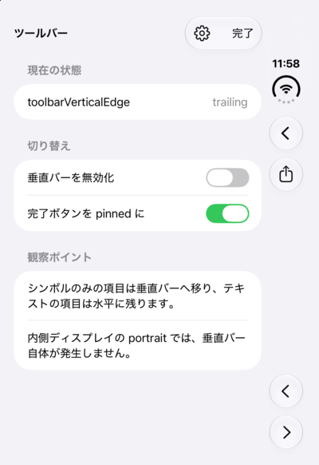 | 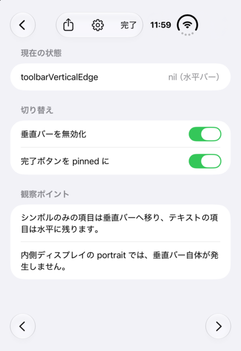 | 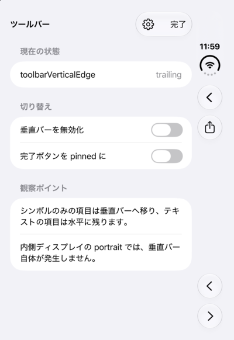 |
| open / landscape | 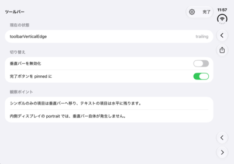 | 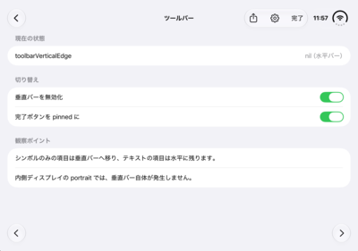 | 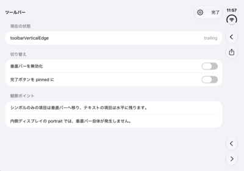 |
| open / portrait | 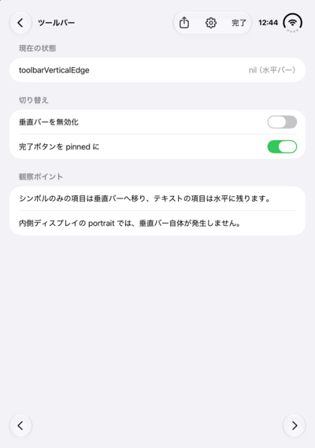 | 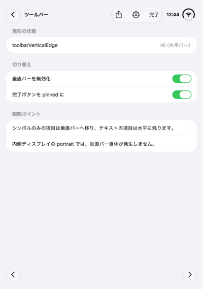 | 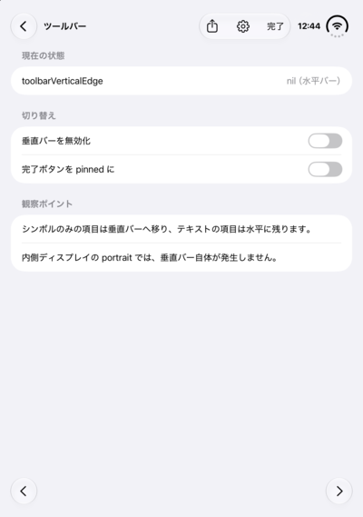 |

画面の中央にある「toolbarVerticalEdge」の行が、その姿勢で読めた値です。

### 可視性優先度（iOS 27.0）

項目が詰まったときに、どれを先にオーバーフローへ送るかを決めます。

```swift
struct ToolbarItemVisibilityPriority { ... }   // SwiftUI モジュール
func visibilityPriority(_ priority: ToolbarItemVisibilityPriority) -> ...
```

既定は `automatic` で、段階は `high` / `low` です。カスタムの優先度は `init(higherThan:)` / `init(lowerThan:)` で作ります。項目単位のほか `ToolbarItemGroup` 単位でも設定でき、HIG は、まずグループ単位で決めるよう案内しています。項目は既定で、下から上の順にオーバーフローします。

UIKit は `UIBarButtonItemVisibilityPriority` です。

### オーバーフローメニュー（iOS 27.0）

```swift
ToolbarOverflowMenu { ... }
func toolbarOverflowMenu(content: ...) -> some View
```

UIKit は `UINavigationItem.additionalOverflowItems` です。独自のオーバーフローを持っている場合は、システムが管理する単一のメニューに統合します。省略記号のシンボルはオーバーフロー専用にして、他プラットフォームのシンボルは持ち込まないでください。

### ToolbarItemPlacement.topBarPinnedTrailing

```swift
@available(iOS 27.0, visionOS 27.0, *)
static let topBarPinnedTrailing: ToolbarItemPlacement
```

追加されたのは iOS 27.0 で、27.1 ではありません。`topBarPinnedLeading` は存在しません。UIKit は `UINavigationItem.pinnedTrailingGroup` です（`UIBarButtonItem.creatingFixedGroup()` で生成します）。

### badge（iOS 26.0）

件数をカスタムビューのテキストで表示していると、その項目は水平バーに残ります。badge に置き換えると、垂直バーへ移せる項目が増えます。

```swift
.badge(_:)                       // SwiftUI
UIBarButtonItem.badge            // UIKit（UIBarButtonItem.Badge）
```

UIKit の `Badge` は `.count(_:)` / `.string(_:)` / `.indicator(_:)` の 3 形態で、背景色やフォントも指定できます。

### 垂直バーへ移るものの判定

- アイコンを持つ項目は垂直バーへ移り、テキストだけの項目は水平バーに残ります
- システムの編集ボタンは水平のままです
- UIKit のカスタムビューや複雑なビューは、既定で水平のままです
- HIG は、SwiftUI の `Label`（タイトルとアイコンの両方を持つ）を使うよう勧めています

カスタムビューにテキストが要るかどうかは、次のように判断します。テキストがシンボルの補足にすぎないなら削ります。買い物カゴの金額のように独立した意味を持つなら、水平バーに残します。

### 配置の順序

垂直バーでは、上部に戻る・閉じるなどの主要ナビゲーションを置き、その後に完了などの主要アクションを置きます。残りは元のグループを維持します。水平と垂直が切り替わっても、配置の一貫性を保ってください。

### その他の挙動

- 分割ビューで垂直バーの対象になるのは、detail 列だけです。他の列は水平のままです。展開されたインスペクタに、独立した垂直バーは設けません
- RTL 言語でも、バーは端末の同じ側に固定されます。周囲のコンテンツのほうが配置を変えます
- 垂直バーは、既定ではスクロール端の効果を持ちません
- 可変スペーサーは、縦軸では既定でサイズがゼロになります。固定スペーサーは最小サイズを維持します
- キーボードのアクセサリバーは、縦軸へ移動しません
- バーの向きにかかわらず、アプリ側で追加の間隔を作らないでください
- 側面へ移るのは、Dynamic Island、ステータスバー、ツールバー（ナビゲーションボタンを含む）、タブバーです
- `UITabBar` を生成してサブビューとして追加している場合、垂直バーへは自動で移りません。`UITabBarController` / `TabView` に置き換えるか、reserved regions で自前で寸法を合わせます

## 5. ContentMarginGuide（iOS 27.1）

UIKit の `layoutMarginsGuide` に近い SwiftUI 版です。ただし返すのは、safe area の外側に足す余白だけで、safe area の分は含みません（下の実測）。

```swift
struct ContentMarginGuide {
    static var container: ContentMarginGuide   // 現状このガイドのみ
}

extension View {
    func contentMargins(for guide: ContentMarginGuide, edges: Edge.Set = .all, alignment: Alignment? = nil) -> some View
}

extension GeometryProxy {
    func contentMargins(for guide: ContentMarginGuide, edges: Edge.Set = .all) -> EdgeInsets
}
```

UIKit には `UIView.LayoutRegion`（iOS 26.0）があります。safe area、layout margins、readable content の各領域を、画面の丸い角への追従を指定したうえで取得できます。取得には `layoutGuide(for:)` / `edgeInsets(for:)` / `directionalEdgeInsets(for:)` を使います。

### 実測: `contentMargins(for:edges:)` が返す値

`GeometryProxy.contentMargins(for: .container, edges:)` の返り値です。`EdgeInsets` の top / bottom / leading / trailing の順で、単位は pt です。

| 姿勢 | `.all` と `.horizontal` | `.leading` | `.trailing` | `.top` / `.bottom` / `.vertical` |
| --- | --- | --- | --- | --- |
| closed / portrait | 0 / 0 / **20** / 0 | 0 / 0 / **20** / 0 | 0 / 0 / 0 / 0 | すべて 0 |
| closed / landscape（バーが右） | 0 / 0 / **20** / 0 | 0 / 0 / **20** / 0 | 0 / 0 / 0 / 0 | すべて 0 |
| closed / landscape（バーが左） | 0 / 0 / 0 / **20** | 0 / 0 / 0 / 0 | 0 / 0 / 0 / **20** | すべて 0 |
| open / portrait | 0 / 0 / **20** / **20** | 0 / 0 / **20** / 0 | 0 / 0 / 0 / **20** | すべて 0 |
| open / landscape | 0 / 0 / **20** / 0 | 0 / 0 / **20** / 0 | 0 / 0 / 0 / 0 | すべて 0 |
| partial / portrait | 0 / 0 / **20** / **20** | 0 / 0 / **20** / 0 | 0 / 0 / 0 / **20** | すべて 0 |
| partial / landscape | 0 / 0 / **20** / 0 | 0 / 0 / **20** / 0 | 0 / 0 / 0 / 0 | すべて 0 |

- 値があるのは、水平方向（leading と trailing）だけです。**垂直方向は、どの姿勢でも 0** です
- 水平方向は 20pt です。ただし、**垂直バーがある辺は 0** になります。closed / portrait でバーが trailing にあれば、trailing は 0、leading は 20 です
- `edges` は、返す辺を絞るだけです。`.all` と `.horizontal` は同じ値を返し、`.leading` は leading の値だけ、`.trailing` は trailing の値だけを返します
- 引数に渡せるガイドは、`.container` だけです

**UIKit の `layoutMargins` との関係**を、同じ姿勢で読み比べました。

| 姿勢 | `safeAreaInsets` | `systemMinimumLayoutMargins` | `layoutMargins` | SwiftUI の `.all` |
| --- | --- | --- | --- | --- |
| closed / portrait | 82 / 34 / 0 / 84 | 0 / 0 / 20 / 0 | 82 / 34 / 20 / 84 | 0 / 0 / 20 / 0 |
| closed / landscape（バーが左） | 82 / 34 / 84 / 0 | 0 / 0 / 0 / 20 | 82 / 34 / 84 / 20 | 0 / 0 / 0 / 20 |
| open / portrait | 82 / 34 / 0 / 0 | 0 / 0 / 20 / 20 | 82 / 34 / 20 / 20 | 0 / 0 / 20 / 20 |
| open / landscape | 82 / 34 / 0 / 84 | 0 / 0 / 20 / 0 | 82 / 34 / 20 / 84 | 0 / 0 / 20 / 0 |

UIKit の `layoutMargins` は、`safeAreaInsets` に `systemMinimumLayoutMargins` を足した値です。SwiftUI の `contentMargins(for: .container)` は、**safe area の外側に足す余白（`systemMinimumLayoutMargins`）だけ**を返します。safe area の分は含みません。UIKit の `layoutMargins` の代わりに使うときは、`safeAreaInsets` を足してください。

### 実測: `View.contentMargins(for:edges:alignment:)` の効果

この修飾子を付けたビューが、実際にどこに描かれるかを、画面を撮って画素から測りました。数値は画面の左端を 0 とした x の範囲（pt）です。対象は、青い `Color` を全面に広げたビューです。

| 姿勢（画面の幅） | 修飾子なし | `.contentMargins(for: .container)` | `.ignoresSafeArea()` のみ | 修飾子 → `.ignoresSafeArea()` | `.ignoresSafeArea()` → 修飾子 |
| --- | --- | --- | --- | --- | --- |
| closed / portrait（466） | 0–382 | **20**–382 | 0–466 | **20**–466 | **20**–466 |
| closed / landscape・バーが右（678） | 0–594 | **20**–594 | 0–678 | **20**–678 | **20**–678 |
| closed / landscape・バーが左（678） | 84–678 | 84–**658** | 0–678 | 0–**658** | 0–**658** |
| open / portrait（669） | 0–669 | **20**–**649** | 0–669 | **20**–**649** | **20**–**649** |
| open / landscape（951） | 0–867 | **20**–867 | 0–951 | **20**–951 | **20**–951 |
| partial / portrait（669） | 0–669 | **20**–**649** | 0–669 | **20**–**649** | **20**–**649** |
| partial / landscape（951） | 0–867 | **20**–867 | 0–951 | **20**–951 | **20**–951 |

- **この修飾子は、`GeometryProxy.contentMargins` が返す値の分だけ、ビューを内側に寄せます。** 全面に広げたビューに付けると、margin のある辺だけ、その分だけ空きができます
- `.ignoresSafeArea()` で画面の端まで広げても、margin は残ります。バーの下まで広げつつ、leading にだけ 20pt の空きを残せます。`.ignoresSafeArea()` との順序は、結果に影響しませんでした
- 縦方向の margin は、どの姿勢でも 0 です（`GeometryProxy.contentMargins` が返す値）。`View` の修飾子に `edges: .vertical` を付けた場合は、測っていません
- **固定サイズのビューは動きません。** 100pt 四方のビューに付けたところ、x 383.7–483.7 に描かれました（open / landscape）。これは、safe area 全体（x 0–867）の中央です。margin を引いた領域（x 20–867）の中央なら、x 393.5–493.5 になるはずで、そうはなりませんでした。この修飾子は、子ビューに与える幅を縮める働きだと考えられます
- **`alignment` の効果は、確認できませんでした。** 100pt 四方のビューでも、画面より大きい幅 1200 のビューでも、`nil` / `.leading` / `.trailing` / `.center` の 4 通りで、見た目の位置は同じでした

なお、`onGeometryChange` で読んだ frame は、この修飾子や `.ignoresSafeArea()` による見た目の変化を反映しませんでした。実験の初期に、x 20–867 に描かれるビューの frame が `0–867` と報告されるのを見ています（この値の記録は残していません）。**位置は frame の数値ではなく、画面で確認してください。**

| 修飾子なし | `.ignoresSafeArea()` のみ | `.contentMargins(for: .container)` | 修飾子 → `.ignoresSafeArea()` |
| --- | --- | --- | --- |
| 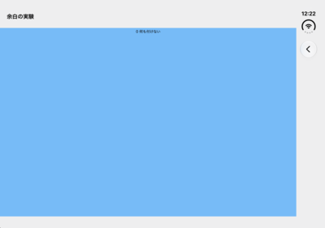 | 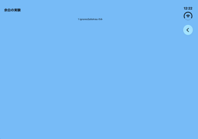 | 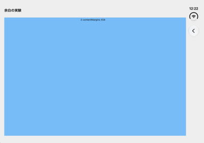 | 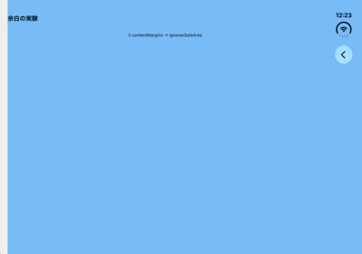 |

上の 4 枚は open / landscape です。バーは右にあり、trailing の margin は 0 なので、右は空きません。

| closed / portrait | open / portrait |
| --- | --- |
| 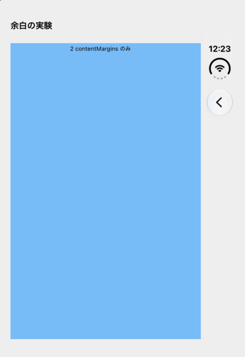 | 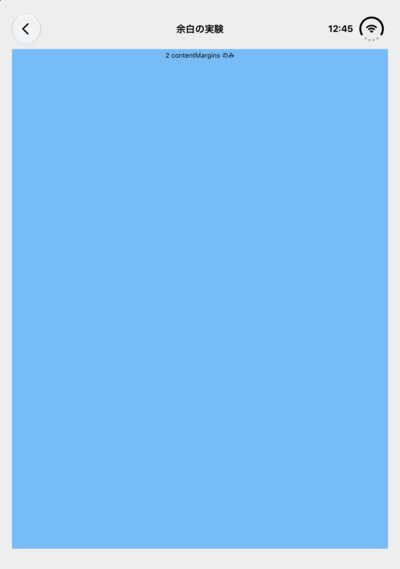 |

どちらも `.contentMargins(for: .container)` を付けたものです。closed / portrait は右にバーがあるので、左だけに空きができます。open / portrait はバーがないので、左右に 20pt ずつ空きができます。

## 6. タブバーのサイドバー化（iOS 27.0）

内側ディスプレイでタブバーをサイドバーとして出します。

```swift
@available(iOS 27.0, *)
func defaultTabBarPlacement(_ defaultPlacement: AdaptableTabBarPlacement) -> some View
func defaultAdaptableTabBarPlacement(_ defaultPlacement: AdaptableTabBarPlacement = .automatic) -> some View

struct AdaptableTabBarPlacement: Hashable {
    static let automatic: AdaptableTabBarPlacement
    static let tabBar: AdaptableTabBarPlacement
    static let sidebar: AdaptableTabBarPlacement
}
```

iOS 18 の `.tabViewStyle(.sidebarAdaptable)` も SDK に残っています。ただし Duo では、Apple は `defaultTabBarPlacement(_:)` を使うよう案内しています。UIKit は `UITabBarController.Sidebar.Placement` です。

## 7. シートの配置

- 外側ディスプレイでは、標準で側面に操作部が出ます。内側では、縦横どちらの向きでも水平バーになります（「内側 portrait は水平バー」という一般則より、条件が広い点に注意してください）
- 垂直バーを無効にすると、シートは前面カメラの手前までを使って表示されます。ステータスバーも再配置されます
- UIKit で配置を変更した場合、左側では垂直バーなし、右側では垂直バーありになります

配置は、SwiftUI では `PresentationPlacement`、UIKit では `UISheetPresentationController.preferredPlacement`（iOS 27.0）で指定します。

### 実測: シートの大きさと位置

3 種類のシートを出し、シートの中から `GeometryReader` で大きさを読みました。数値は `幅 × 高さ` で、括弧は safe area（top / bottom / leading / trailing）です。closed / landscape は、バーが左に出る向きで測りました。

| 姿勢 | 素のシート | `NavigationStack` 入り | `.toolbarVerticalBehavior(.disabled)` を付けた `NavigationStack` 入り |
| --- | --- | --- | --- |
| closed / portrait | 374 × 636（0 / 34 / 0 / **76**） | 374 × 562（74 / 34 / 0 / **76**） | **450 × 480**（74 / **0** / 0 / **0**） |
| closed / landscape | 586 × 424（0 / 34 / **76** / 0） | 586 × 350（74 / 34 / **76** / 0） | **662 × 268**（74 / **0** / 0 / **0**） |
| open / portrait | 653 × 827 | 653 × 753（74 / 34 / 0 / 0） | 653 × 753 |
| open / landscape | 653 × 627 | 653 × 553（74 / 34 / 0 / 0） | 653 × **471** |
| partial / portrait | 653 × 827 | 653 × 753 | 653 × 753 |
| partial / landscape | **459.5 × 627** | **459.7 × 553** | **459.3 × 471** |

- **外側ディスプレイのシートには、垂直バーが出ます。** 幅 76pt のバーの分だけ、safe area の trailing（バーが左なら leading）が 76 になります。内側のシートには、垂直バーは出ません（左右の safe area は 0 です。partial / landscape の素のシートだけ、trailing が 0.2 でした）
- **`.toolbarVerticalBehavior(.disabled)` の効果は、姿勢で違いました。** closed では、垂直バーの 76pt が消えて、幅が 76pt 広がります（374 → 450、586 → 662）。一方で、高さは 82pt 縮みます（562 → 480、350 → 268）。内側の landscape では、幅は変わらず、高さが 82pt 縮みます（553 → 471）。内側の portrait では変わりません。高さが縮む理由は確認していません
- **折り目を避けて位置が変わるのは、landscape だけでした。** partial / landscape では、シートは折り目の左側に収まります（幅 459.5、折り目の左の領域は 455.7）。**partial / portrait では、折り目（横帯）をまたいで、open / portrait と同じ 653 × 827 で出ます**
- シートの中から `reservedRegions(kind: .division)` を読むと、partial のときだけ 1 件返ります（closed と open では 0 件）。シートが折り目を避けていても、折り目の領域は見えます
- アラートも、partial / landscape では、折り目の左側の領域の中央に出ました（画像）

| closed / portrait | closed / landscape（バーが左） | open / portrait |
| --- | --- | --- |
| 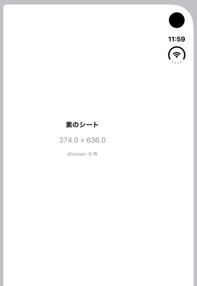 | 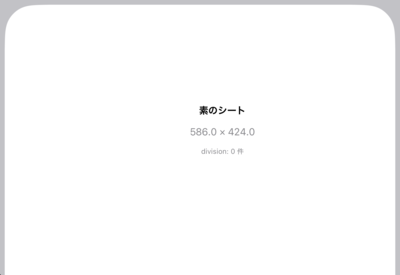 | 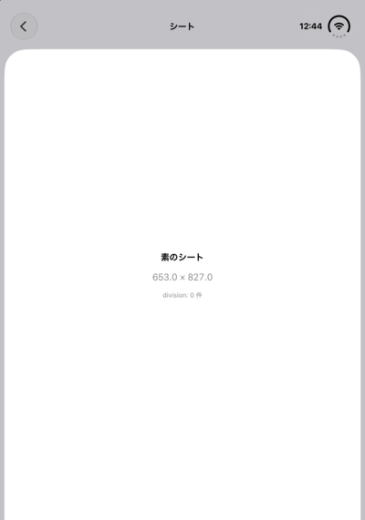 |

| open / landscape | partial / portrait | partial / landscape |
| --- | --- | --- |
| 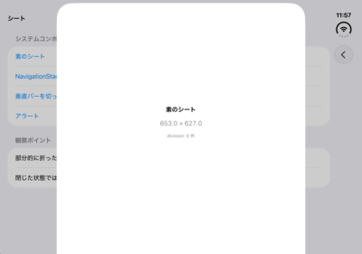 | 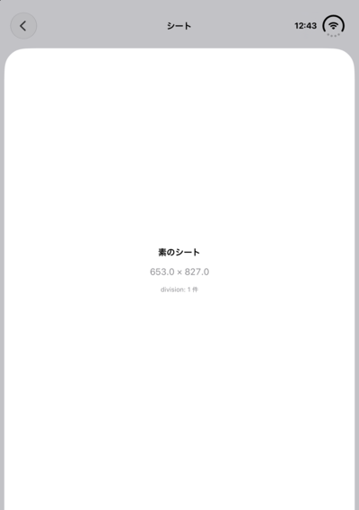 | 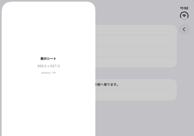 |

上の 6 枚は素のシートです。アラートは次のとおりです。

| closed / portrait | partial / landscape |
| --- | --- |
| 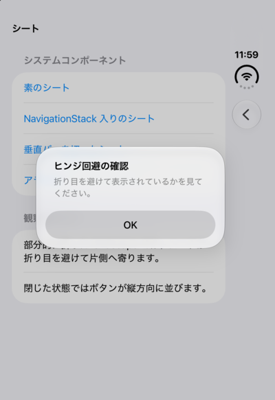 | 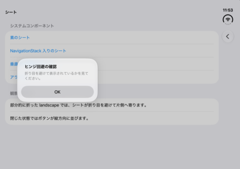 |

## 8. 画面の角に合わせる（iOS 26）

Concentricity（同心）の指定です。丸い画面の角と同心になるように、形を角へ追従させます。

```swift
ConcentricRectangle()                      // SwiftUI（SwiftUICore）
UIView.cornerConfiguration                 // UIKit（UICornerConfiguration）
```

`UICornerRadius` は、`fixed(_:)` で固定値を、`containerConcentric(minimum:)` でコンテナに対して同心になる半径を表します。`corners(topLeftRadius:topRightRadius:bottomLeftRadius:bottomRightRadius:)` を使えば、隅ごとに指定もできます。

## 9. 複数シーンと scene accessory

### 複数インスタンス

iPhone Duo は、アプリの UI を複数インスタンスで表示できる最初の iPhone です。iPad で対応済みなら、そのまま動きます。

新規ウインドウを作成できるのは内側ディスプレイだけで、外側では作成できません。作成できるかどうかは動的に変わるので、エラー処理が必要です。

```swift
UIApplication.activateSceneSession(for:errorHandler:)   // iOS 17.0
UISceneSessionActivationRequest
UISceneError.Code   // .requestDenied（外側）/ .multipleScenesNotSupported /
                    // .geometryRequestUnsupported / .geometryRequestDenied
```

`requestSceneSessionActivation(_:userActivity:options:errorHandler:)` は非推奨です。SwiftUI 側は `openWindow` / `supportsMultipleWindows` を使います。

`@AppStorage` のように保存先を参照する状態は、複数インスタンス間で共有されます。更新は、既存の仕組みでそのまま反映されます。

### sceneAccessory（iOS 27.0）

```swift
@available(iOS 27.0, *)
func sceneAccessory<C: SceneAccessoryContent>(@ViewBuilder content: () -> C) -> some View

extension SceneAccessoryContent {
    func onAvailabilityChange(perform action: @escaping (_ isAvailable: Bool) -> Void) -> some SceneAccessoryContent
}
```

| 型 | availability |
| --- | --- |
| `ExternalNonInteractiveAccessory<Content: View>` | iOS 27.0 |
| `CameraCaptureAccessory<Content: View>` | iOS 27.1 |

この機能は iPhone Duo 専用ではありません。iPhone / iPad 共通です。たとえば、外部ディスプレイにゲームを表示し、iPhone をコントローラーにする用途があります。

利用可否は、システムが動的に管理します。既定は有効ですが、随時切り替わります。このため、`onAvailabilityChange` に加えて observation tracking でも追従するよう、Apple は案内しています。

`CameraCaptureAccessory` を使える条件は、内側ディスプレイでの全画面表示と、アクティブなカメラセッションです。両ディスプレイを同時に点灯できるのは、カメラアプリだけです。

1 日目の Group Lab では「システムの entitlement が必要」と説明されました。ただし名前も申請方法も公開されておらず、Apple のドキュメントにも entitlement への言及はありません。現時点では未確認の情報として扱ってください。テント姿勢で内側ディスプレイを光らせる時計のような表示は、AlarmKit の機能です。アラーム以外では同じことはできない見込みです。

アクセサリに置ける内容に制限はありません。渡されるのは完全な UIScene で、ウィジェットのような制約はありません。

UIKit の対応物は `UISceneAccessory` で、利用可否は `UISceneAccessoryRegistration.isAvailable` で読みます。

## 10. 置き換えが必要な API

| 変更前 | 変更後 |
| --- | --- |
| `UIScreen.main` | `window?.windowScene?.screen` |
| `UIScreen.main.scale` | `traitCollection.displayScale` |
| `UIView._boundaryLayoutRegions` | `reservedRegions(kind: .division)` |
| `requestSceneSessionActivation(...)` | `UIApplication.activateSceneSession(for:errorHandler:)` |

`UIScreen.main` は、公式ドキュメント上ではすでに非推奨扱いです。将来のリリースで正式に非推奨になるとも説明されています。`UIRequiresFullScreen`（Info.plist のキー）も、当面は尊重されますが非推奨扱いです。iOS 27 SDK でリンクした時点でリサイズ対応が有効になり、Xcode 27 で従来の表示のまま据え置く方法はない、と回答されています。

## 11. SwiftUI / UIKit 対応表

| SwiftUI | UIKit |
| --- | --- |
| `ToolbarItemPlacement.topBarPinnedTrailing` | `UINavigationItem.pinnedTrailingGroup` |
| `toolbarVerticalEdge` | `traitCollection.verticalBarEdge` |
| `toolbarVerticalCompressionBehavior(_:)` | `UINavigationItem.verticalBarCompressionBehavior` |
| `toolbarVerticalBehavior(_:)` | `preferredVerticalBarBehavior` を override |
| `ToolbarOverflowMenu` / `toolbarOverflowMenu(content:)` | `UINavigationItem.additionalOverflowItems` |
| `ToolbarItemVisibilityPriority` | `UIBarButtonItemVisibilityPriority` |
| `axisBehavior(_:)` | `UIBarButtonItem.axisBehavior` |
| `ArrangementView` | `UIArrangementViewController` |
| `.split` / `.overlay` | `UISplitArrangement` / `UIOverlayArrangement` |
| `overlayArrangementZIndex` | `UIArrangementViewState.zIndex` |
| `onHingeChange` | `UIHingeInteraction` |
| `PresentationPlacement` | `UISheetPresentationController.preferredPlacement` |
| `defaultTabBarPlacement(_:)` | `UITabBarController.Sidebar.Placement` |
| `ConcentricRectangle` | `UIView.cornerConfiguration` |
| `sceneAccessory(content:)` | `UISceneAccessory` |

### UIKit の Arrangement 系（iOS 27.1）

- `UIArrangementViewController: UIViewController` — `setViewController(_:for:animated:)`、`viewController(for:)`、`placement(for:)`、`state(for:)`、`updateArrangement(_:animated:)`
- `UIArrangementViewController.ViewPlacement` — `.none` / `.primary` / `.secondary`
- `UIArrangementViewState` — `zIndex: Int`、`splitAxis: UIAxis`、`isHidden: Bool`（ヘッダ上の型名は `UIArrangementViewState`）
- `UISplitArrangement` — `.splitArrangement()`、`axes: UIAxis`、`defaultViewProperties`
  - `UISplitArrangementDimension` — `.automatic()` / `.intrinsic()` / `.fractional(_:)` / `.absolute(_:)`
- `UIOverlayArrangement` — `.overlayArrangement()`、`axes: UIAxis`、`defaultViewProperties.edge: NSDirectionalRectEdge`

## 12. 背景を垂直バーの背後へ広げる（iOS 26.0）

公式の "Preparing your app for iPhone Duo" は、ヒーロー画像や背景画像を safe area の中に収めず、垂直バーの下まで広げるよう指示しています。

> If your view has a hero or background image, extend it under a vertical bar using `backgroundExtensionEffect()` in SwiftUI, or `UIBackgroundExtensionView` in UIKit.

```swift
BannerView()
    .backgroundExtensionEffect()   // SwiftUI

UIBackgroundExtensionView          // UIKit
```

ビューを鏡像に複製して safe area の外側に並べ、その上をぼかす効果です。見やすさと性能のため、通常は 1 つの背景にだけ使います。

## 13. 垂直バーの切り替えは安定した値にする

`toolbarVerticalBehavior(_:)` は、画面遷移のたびに切り替えたり、ビューの状態に応じてトグルしたりしないでください。値が変わると、コンテンツが水平バーとの間で流れ直します。ステータスバーの軸と safe area も変わります。特定の画面でバーを隠したいだけなら、`toolbarVisibility(_:for:)` を使います。

コンテナごとに、どのビューの指定が使われるかは次のとおりです（Group Lab の内容を解説資料から引用したもので、公式ドキュメントでは未確認です）。

| コンテナ | どのビューの指定が効くか |
| --- | --- |
| `NavigationStack` | 最前面のビュー |
| `TabView` | 選択中のビュー |
| `NavigationSplitView` | 最も trailing 側の列 |

## 14. シートの配置（iOS 27.0）

```swift
.sheet(isPresented: $isShowingDetail) {
    DetailView()
        .presentationPlacement(.leading)
}
```

`PresentationPlacement` は、SDK 上では `.automatic` / `.leading` / `.center` / `.trailing` の 4 つです。UIKit は `UISheetPresentationController.preferredPlacement` です。この配置を見るのはシートだけで、ポップオーバーなど他の presentation には効きません。

内側ディスプレイでは、centered / leading 配置なら水平バーになり、trailing 配置なら垂直バーになります。地図のように、背後のコンテンツを広く見せたい場合に使います。

### 実測: 配置ごとのシートの大きさ

`.presentationPlacement(_:)` に 4 つの値を渡して、`NavigationStack` 入りのシートの大きさを読みました。数値は `幅 × 高さ` で、括弧は safe area の trailing です。

| 姿勢 | `.automatic` | `.leading` | `.center` | `.trailing` |
| --- | --- | --- | --- | --- |
| closed / portrait | 374 × 562（76） | 374 × 562（76） | 374 × 562（76） | 374 × 562（76） |
| closed / landscape（バーが左） | 586 × 350 | 586 × 350 | 586 × 350 | 586 × 350 |
| open / portrait | 653 × 753（0） | 653 × 753（0） | 653 × 753（0） | 653 × 753（0） |
| open / landscape | 653 × 553（0） | 653 × 553（0） | 653 × 553（0） | **577 × 553（76）** |
| partial / portrait | 653 × 753（0） | 653 × 753（0） | 653 × 753（0） | 653 × 753（0） |
| partial / landscape | 459.7 × 553（0） | 459.7 × 553（0） | 459.7 × 553（0） | **383.7 × 553（76）** |

- **効いたのは、内側の landscape で `.trailing` を指定したときだけです。** シートの右側に垂直バー（76pt）が出て、その分だけ幅が縮みます（653 → 577、459.7 → 383.7）
- 位置は、`.leading` が左端、`.trailing` が右端、`.center` は中央です。`.automatic` は `.center` と同じ結果でした（画像）
- 外側ディスプレイ（closed）と、内側の portrait では、4 つの値で結果が変わりませんでした。closed のシートには、もともと垂直バーが付いています

| `.automatic` | `.leading` | `.center` | `.trailing` |
| --- | --- | --- | --- |
| 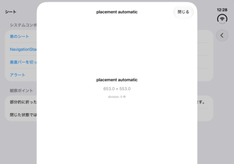 | 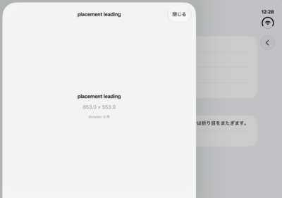 | 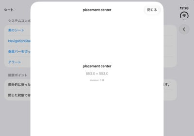 | 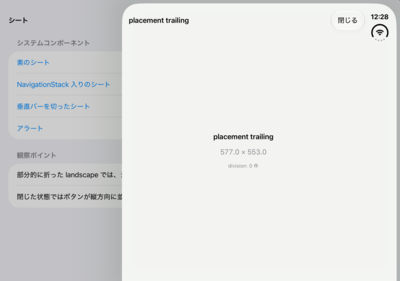 |

上の 4 枚は open / landscape です。partial / landscape で、折り目の左側に収まるシートの `.leading` と `.trailing` は次のとおりです。

| `.leading` | `.trailing` |
| --- | --- |
| 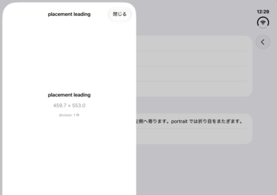 | 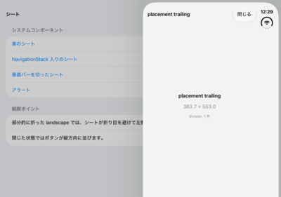 |

## 15. 自作バーのための領域問い合わせ（iOS 27.1）

`UITabBar` などを自前で配置しているアプリが、垂直バーの寸法に合わせるための API です。

```swift
@available(iOS 27.1, *)
extension UIView.LayoutRegion {
    static func bar(onEdge edge: UIRectEdge, extent: CGFloat) -> UIView.LayoutRegion
    static func bar(onEdge edge: NSDirectionalRectEdge, extent: CGFloat) -> UIView.LayoutRegion
}
```

ヘッダのコメントは "Returns a bar layout region of a given extent on a given edge." です。1 つの領域に指定できる辺は、1 つだけです。

Group Lab では「iOS 27.1 で、システムがバーを描く領域を、位置を指定して問い合わせる API が入る」と案内されました。ただし名前は示されず、解説資料（d-date/iphone-duo-skill）でも特定できていませんでした。この API が実在することは、27.1 SDK のヘッダで確認しています。ただし、独自のタブバーにシステムのタブバーと同じ挙動（スクラブ中のラベル表示、圧縮の判断）を与える API はありません。まず `UITabBarController` / `TabView` への置き換えを検討してください。

### 角への追従（iOS 26.0）

同じ `UIView.LayoutRegion` には、画面の丸い角に追従させる指定もあります。

```swift
static func safeArea(cornerAdaptation: UIView.LayoutRegion.AdaptivityAxis? = nil) -> UIView.LayoutRegion
static func margins(cornerAdaptation: UIView.LayoutRegion.AdaptivityAxis? = nil) -> UIView.LayoutRegion
static func readableContent(cornerAdaptation: UIView.LayoutRegion.AdaptivityAxis? = nil) -> UIView.LayoutRegion
// AdaptivityAxis: .none / .horizontal / .vertical
```

バーを持たない全画面アプリ（ゲームなど）で、safe area 全体は避けず、カメラとステータスバーの領域だけを避けたい場合に使えます。

外側ディスプレイの 4 隅は半径がそろっていません（ヒンジから遠い側のほうが丸くなっています）。これまで角を扱う必要がなかった位置にも、角が現れます。UIKit で同心の角にする書き方は次のとおりです。

```swift
view.cornerConfiguration = .uniformCorners(radius: .containerConcentric(minimum: 0))
```

### 実測: `edgeInsets(for:)` の値

`view.edgeInsets(for:)` が返す `UIEdgeInsets` の値です。**top / bottom / left / right** の順で、単位は pt です。`UIEdgeInsets` なので、左右は leading / trailing ではなく物理的な left / right です。画面全体に広げた view で読みました。

| 姿勢 | `.safeArea()` | `.safeArea(cornerAdaptation: .horizontal)` | `.margins()` | `.readableContent()` |
| --- | --- | --- | --- | --- |
| closed / portrait | 82 / 34 / 0 / 84 | 82 / 34 / **2.3** / 84 | 82 / 34 / 20 / 84 | 82 / 34 / **52** / 84 |
| closed / landscape（バーが右） | 82 / 34 / 0 / 84 | 82 / 34 / **17.3** / 84 | 82 / 34 / 20 / 84 | 82 / 34 / **52** / 84 |
| closed / landscape（バーが左） | 82 / 34 / 84 / 0 | 82 / 34 / 84 / **17.3** | 82 / 34 / 84 / 20 | 82 / 34 / 84 / **52** |
| open / portrait | 82 / 34 / 0 / 0 | 82 / 34 / **16** / **16** | 82 / 34 / 20 / 20 | 82 / 34 / 20 / 20 |
| open / landscape | 82 / 34 / 0 / 84 | 82 / 34 / **16** / 84 | 82 / 34 / 20 / 84 | 82 / 34 / **52** / 84 |
| partial / portrait | 82 / 34 / 0 / 0 | 82 / 34 / **16** / **16** | 82 / 34 / 20 / 20 | 82 / 34 / 20 / 20 |
| partial / landscape | 82 / 34 / 0 / 84 | 82 / 34 / **16** / 84 | 82 / 34 / 20 / 84 | 82 / 34 / **52** / 84 |

- `.safeArea()` は、`view.safeAreaInsets` と同じ値です。`.margins()` は `view.layoutMargins` と同じ値です
- **`cornerAdaptation: .horizontal` を付けると、画面の角の丸みの分だけ、left / right が広がります。** 内側ディスプレイの角は 16pt です。外側ディスプレイは、向きで違います（portrait の左は 2.3pt、landscape の左は 17.3pt）。すでにバーで 84pt 取られている辺は、変わりません
- `.safeArea(cornerAdaptation: .vertical)` は、全姿勢で `.safeArea()` と同じ値でした。`.margins(cornerAdaptation: .horizontal)` も、`.margins()` と同じ値でした。margin の 20pt が、角の丸みより大きいためと考えられます
- `.readableContent()` は、landscape で left が 52（バーが左なら right が 52）になります。portrait の内側では 20 で、`.margins()` と同じです。読みやすい行の幅に収めるため、余白が広がっていると考えられます。この理由までは確認していません

**`.bar(onEdge:extent:)`** は、その辺にバーを置いたと仮定した領域を返します。`extent` を 84 にして、左の辺と右の辺で読みました。

| 姿勢 | `.bar(onEdge: .left, extent: 84)` | `.bar(onEdge: .right, extent: 84)` |
| --- | --- | --- |
| closed / portrait | 82 / 34 / **6** / 376 | **170** / 34 / 376 / **6** |
| closed / landscape（バーが右） | 82 / 34 / **6** / 588 | 82 / **82** / 588 / **6** |
| closed / landscape（バーが左） | 82 / 34 / **6** / 588 | 82 / 34 / 588 / **6** |
| open / portrait | 82 / 34 / **6** / 579 | 82 / 34 / 579 / **6** |
| open / landscape | 82 / 34 / **6** / 861 | **120** / 34 / 861 / **6** |
| partial / portrait | 82 / 34 / **6** / 579 | 82 / 34 / 579 / **6** |
| partial / landscape | 82 / 34 / **6** / 861 | **120** / 34 / 861 / **6** |

- 領域の幅は、`extent` の 84pt です。画面の端から **6pt** 内側に置かれます（左の辺なら left が 6、right は「画面幅 − 6 − 84」です）
- 右の辺では、top（や bottom）が大きくなる姿勢があります。closed / portrait で 170、open / landscape で 120、closed / landscape（バーが右）で bottom が 82 です。**これは、その辺にある `.occlusion` の領域の高さと一致します**（[実測: 領域の位置と margins](#実測-領域の位置と-margins)）。バーの領域が、カメラなどの領域を避けて置かれています
- バーが左に出る closed / landscape の左の辺では、そのような食い込みはありません。左の辺の `.occlusion`（84×82）は、safe area の top（82）と同じ高さで、見分けられません

## 16. カメラ用 scene accessory の登録（UIKit / iOS 27.1）

```swift
let configuration = UISceneConfiguration()
configuration.delegateClass = ScriptSceneDelegate.self

let accessory = UISceneAccessory.cameraCapture(sceneConfiguration: configuration, userInfo: model)
registration = registerSceneAccessory(accessory)   // 戻り値は強参照で保持する
```

- 登録先は、撮影画面を表示しているビューです。そのビューが画面にある間だけ、コンテンツが出ます
- `unregisterSceneAccessory(_:)` を呼ぶのは、提供をやめるときだけです。一時的に止めたいときは、登録を残して `isEnabled` を切ります
- session role（`UISceneSession.Role.windowCameraCaptureAccessory`）は、システムが割り当てます。シーンマニフェストに書いても効きません
- 状態は送り合わず、同じオブジェクトを共有します。UIKit では `userInfo` で渡し、接続時に `UIScene.ConnectionOptions.sceneAccessoryUserInfo` から取り出します

利用可否とオン・オフは別のものです。

| | 決めるのは | SwiftUI | UIKit |
| --- | --- | --- | --- |
| 利用可否 | システム | `onAvailabilityChange(perform:)` | `isAvailable` |
| オン・オフ | アプリ | `CameraCaptureAccessory(isEnabled:)` | `isEnabled` |

利用可否は、キャプチャの停止、アプリが前面から外れる、端末を閉じる、開いた状態の Split View などで変わります。同じ種類の登録は、最も手前のものだけが表示されます。外側ディスプレイがない端末では `isAvailable` が false を返し続けるので、1 つの経路で書けます。

## SDK に存在しなかったもの

- `topBarPinnedLeading`
- `ReservedRegion.Kind` の `.division` / `.occlusion` 以外
- SwiftUI 側 `DeviceHinge.Status` の `unknown`
- ヒンジ状態を読む EnvironmentValues

Xcode 27.2 Beta の SDK も同じシンボル構成でした。

## 公式ドキュメント未収載の API

2026-09-17 時点で、公式サンプルには出てくるものの、Apple Developer Documentation には見当たらないとされていた API です。いずれもこの SDK には実在します。

- `onHingeChange`
- `toolbarVerticalBehavior(_:)`
- `toolbarVerticalCompressionBehavior(_:)`
