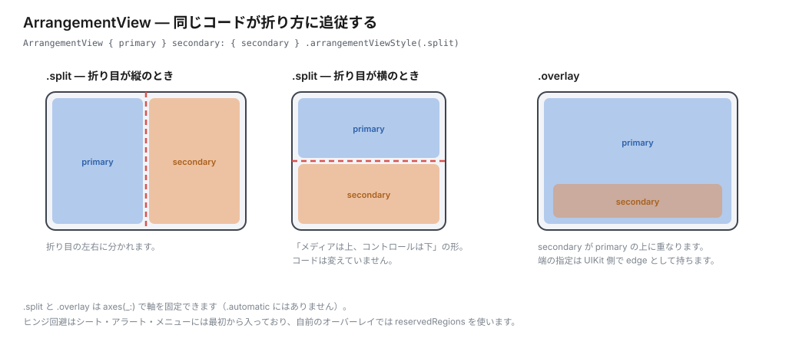

# API リファレンス（iOS 27.1 SDK 実測）

`iPhoneOS27.1.sdk`（Xcode 27.1 Beta）の `.swiftinterface` とヘッダから抽出した内容です。ここに載せている API 名・引数ラベル・availability は、すべて SDK を直接引いて確認しています。

カメラ関連は [04-camera.md](04-camera.md) に分けています。

> SwiftUI 側の実体は **`SwiftUICore`** モジュールにあるものと、**`SwiftUI`** モジュールにあるものが混在します。`SwiftUI` が `SwiftUICore` を再エクスポートするため利用側は `import SwiftUI` だけで足りますが、SDK を grep するときは両方を見る必要があります。

## API の抽象度には層がある

折り目まわりの API は、低レベルから順に次の層になっています。**上の層で足りるなら下の層に降りないのが原則**です。ヒンジ角度から自前で計算する前に、arrangement や reserved regions で済まないかを先に検討してください。

| 層 | 何をするか |
| --- | --- |
| システムコンポーネント | 何もしなくても適応する（シート、アラート、メニュー、ポップオーバー、分割ビュー） |
| arrangement view | 折り目に合わせて 2 つのビューを配置するコンテナ |
| reserved regions | 領域の矩形を取得して自前で避ける |
| ヒンジ | 角度そのもの。インタラクションやエフェクト向け |

資料では用語が 3 つに整理されています。

| 用語 | 位置づけ |
| --- | --- |
| **displacement**（要素の移動） | 設計パターン。**専用 API はありません** |
| **arrangement**（2 ビューの配置） | API。`ArrangementView` など |
| **reserved regions**（確保された領域） | API。displacement を自前実装するときの土台 |

## 1. ArrangementView（iOS 27.1）

2 つのビューの配置を、折り目に合わせてシステムが自動調整します。



```swift
@available(iOS 27.1, *)
struct ArrangementView<Primary: View, Secondary: View>: View {
    init(@ViewBuilder primary: () -> Primary, @ViewBuilder secondary: () -> Secondary)
}
```

```swift
ArrangementView {
    PlayerView()
} secondary: {
    UpNextView()
}
.arrangementViewStyle(.split)
```

配置の判断材料は、ディスプレイのサイズ・向き・size class・縦横比・reserved regions・アクティブな division region です。

### スタイル

| スタイル | 型 | `axes(_:)` |
| --- | --- | --- |
| `.automatic` | `AutomaticArrangementViewStyle` | なし |
| `.split` | `SplitArrangementViewStyle` | あり |
| `.overlay` | `OverlayArrangementViewStyle` | あり |

```swift
func arrangementViewStyle(_ style: some ArrangementViewStyle) -> some View
func axes(_ axes: Axis.Set) -> SplitArrangementViewStyle

.arrangementViewStyle(.split.axes(.horizontal))
```

- **split** — 既定では横長なら水平、縦長なら垂直に分割します。軸を制限できますが、**指定した軸が主軸に対応しない場合は単一ビューの表示になります**
- **overlay** — 通常は重ね合わせ、**端末を折ると横並びを優先**します。secondary を折りたたむこともできます

移行の目安は `HStack` / `VStack` → `.split`、`ZStack` → `.overlay` です。前景と背景の関係が明確なら overlay、主内容と詳細で双方を隠したくないなら split を選びます。

### レイアウトの制御（記事本文のコード例には出てこない）

```swift
@available(iOS 27.1, *)
func splitArrangementLayoutRatio(_ ratio: ...) -> some View
func splitArrangementLayoutRatio(minHorizontal: ..., ...) -> some View
func splitArrangementLayoutSize(minWidth: ..., ...) -> some View
func splitArrangementFixedLayoutSize(horizontal: ..., vertical: ...) -> some View
func overlayArrangementEdge(_ edge: ...) -> some View
```

overlay の重なり順は環境値から読めます。**値が 0 より大きいかで、縮小表示と展開表示を切り替える**のが想定された使い方です。

```swift
@available(iOS 27.1, *)
extension EnvironmentValues {
    var overlayArrangementZIndex: Int { get set }
}
```

UIKit 側では `state(for:)` が返す `UIArrangementViewState` の `zIndex` が対応します。

### 入れ子の制約

`ArrangementView` はナビゲーション基盤を提供しません。そのため次の 2 つは避けます。

- `ArrangementView` の**中に** `NavigationSplitView` などのナビゲーションコンテナを置かない
- `List` や `ScrollView` などスクロールコンテナの**中に** `ArrangementView` を置かない

ナビゲーションは `ArrangementView` の外側に置きます。

## 2. ReservedRegion（iOS 27.1）

折り目やカメラが占める領域を問い合わせます。**`GeometryProxy` のメソッド**です。

```swift
@available(iOS 27.1, *)
extension GeometryProxy {
    func reservedRegions(
        kind: ReservedRegion.Kind,
        options: ReservedRegion.QueryOptions = [],
        layoutDirectionBehavior: LayoutDirectionBehavior = .mirrors
    ) -> [ReservedRegion]
}

@available(iOS 27.1, *)
struct ReservedRegion: Equatable, Hashable, Identifiable, Sendable {
    var id: ReservedRegion.ID
    var kind: ReservedRegion.Kind
    var frame: CGRect
    var margins: EdgeInsets
    var isActive: Bool
}
```

- `ReservedRegion.Kind` — `.division`（折り目）と `.occlusion`（カメラ）の **2 つのみ**。enum ではなく struct の static プロパティです
- `ReservedRegion.QueryOptions` — `OptionSet`。`.includeInactive` **のみ**

```swift
GeometryReader { proxy in
    let folds = proxy.reservedRegions(kind: .division)
    let camera = proxy.reservedRegions(kind: .occlusion, options: [.includeInactive])
}
```

アクティブ・非アクティブの条件は [01-design-principles.md](01-design-principles.md) の「予約領域は 3 種類ある」を参照してください。外側カメラは常に存在し、内側カメラはカメラ作動時のみ、折り目は平らな状態では幅ゼロの非アクティブになります。

UIKit 側は `UIView.reservedRegions(kind:options:)` で、`layoutDirectionBehavior` 引数はありません。`UIView._boundaryLayoutRegions` は iOS 27.0 で deprecated、`reservedRegions(kind: .division)` を使うよう明記されています。

## 3. ヒンジ（iOS 27.1）

**インタラクションやエフェクト向けです。レイアウトには arrangement と region の API を使ってください。**

```swift
@available(iOS 27.1, *)
extension View {
    func onHingeChange(
        isEnabled: Bool = true,
        _ action: @escaping (_ oldContext: DeviceHingeContext, _ newContext: DeviceHingeContext) -> Void
    ) -> some View
}

@available(iOS 27.1, *)
struct DeviceHinge: Hashable, Sendable {
    var status: DeviceHinge.Status
    var angle: Angle                 // SwiftUI の Angle。UIKit は CGFloat
}

@available(iOS 27.1, *)
struct DeviceHingeContext: Equatable, Sendable {
    var hinge: DeviceHinge?          // ヒンジのないデバイスでは nil
}
```

`DeviceHinge.Status` — `.closed` / `.partiallyOpen` / `.fullyOpen` の **3 つ**。

### 記事との差分

記事では型名が `Hinge` のように読めますが、実際は **`DeviceHinge` / `DeviceHingeContext`** です。SwiftUI 側の `Status` に `unknown` は**ありません**（UIKit の `UIHingeStatus` にのみ `.unknown = 0` があります）。ヒンジ状態を読む EnvironmentValues は存在せず、取得手段は `onHingeChange` のみです。

UIKit 側は `UIHinge`（`status` / `angle: CGFloat`）と `UIHingeInteraction`（`init(updateHandler:)`、`isEnabled`、`Update.hinge: UIHinge?`）です。

## 4. ツールバーの垂直配置

### toolbarVerticalBehavior（iOS 27.1）

ビュー全体で垂直バーを使うかどうか。

```swift
@available(iOS 27.1, *)
func toolbarVerticalBehavior(_ behavior: ToolbarVerticalBehavior) -> some View

struct ToolbarVerticalBehavior: Hashable, Sendable {
    static let automatic: ToolbarVerticalBehavior
    static let disabled: ToolbarVerticalBehavior
}
```

ケースは 2 つのみです。UIKit はビューコントローラの `preferredVerticalBarBehavior` を override します。

### ToolbarItemAxisBehavior（iOS 27.1）

**項目単位**の制御です。

```swift
struct ToolbarItemAxisBehavior: Hashable, Sendable {
    static let automatic: ToolbarItemAxisBehavior
    static let horizontalOnly: ToolbarItemAxisBehavior
    static let verticalPreferred: ToolbarItemAxisBehavior
}

func axisBehavior(_ behavior: ToolbarItemAxisBehavior) -> some ToolbarContent
```

UIKit は `UIBarButtonItem.axisBehavior`。

### ToolbarVerticalCompressionBehavior（iOS 27.1）

垂直バーのスペースが足りないとき、ツールバー項目とタブバーのどちらを優先するか。

```swift
struct ToolbarVerticalCompressionBehavior: Hashable, Sendable {
    static let automatic: ToolbarVerticalCompressionBehavior
    static let prefersToolbarItems: ToolbarVerticalCompressionBehavior
    static let prefersTabBar: ToolbarVerticalCompressionBehavior
}

func toolbarVerticalCompressionBehavior(_ behavior: ToolbarVerticalCompressionBehavior) -> some View
```

UIKit は `UINavigationItem.verticalBarCompressionBehavior`。**値の名前が違い、UIKit 側は `.prefersBarItems`** です（SwiftUI は `.prefersToolbarItems`）。

### toolbarVerticalEdge（iOS 27.1）

バーが今どちら側に出ているかを読めます。

```swift
extension EnvironmentValues {
    var toolbarVerticalEdge: HorizontalEdge? { get }
}
```

UIKit は `traitCollection.verticalBarEdge`。型は `UIVerticalBarEdge` で、**`.unspecified` / `.leading` / `.trailing` の 3 値**です（SwiftUI の Optional に対応）。

### 可視性優先度（iOS 27.0）

項目が詰まったときに、どれを先にオーバーフローへ送るかを決めます。

```swift
struct ToolbarItemVisibilityPriority { ... }   // SwiftUI モジュール
func visibilityPriority(_ priority: ToolbarItemVisibilityPriority) -> ...
```

既定は `automatic`、段階は `high` / `low`、カスタムは `init(higherThan:)` / `init(lowerThan:)` で作ります。項目単位のほか `ToolbarItemGroup` 単位でも設定でき、**HIG は「まずグループ単位で決める」ことを案内しています**。項目は既定で**下から上の順にオーバーフロー**します。

UIKit は `UIBarButtonItemVisibilityPriority`。

### オーバーフローメニュー（iOS 27.0）

```swift
ToolbarOverflowMenu { ... }
func toolbarOverflowMenu(content: ...) -> some View
```

UIKit は `UINavigationItem.additionalOverflowItems`。独自のオーバーフローを持っている場合は、単一のシステム管理メニューへ統合します。省略記号の記号はオーバーフロー用途に限定し、他プラットフォームの記号を持ち込まないこと。

### ToolbarItemPlacement.topBarPinnedTrailing

```swift
@available(iOS 27.0, visionOS 27.0, *)
static let topBarPinnedTrailing: ToolbarItemPlacement
```

**iOS 27.0** で追加されたもので 27.1 ではありません。**`topBarPinnedLeading` は存在しません**。UIKit は `UINavigationItem.pinnedTrailingGroup`（`UIBarButtonItem.creatingFixedGroup()` で生成）。

### badge（iOS 26.0）

件数表示をカスタムビューのテキストで持っていると水平バーに残ってしまうため、badge に寄せると垂直配置できる項目が増えます。

```swift
.badge(_:)                       // SwiftUI
UIBarButtonItem.badge            // UIKit（UIBarButtonItem.Badge）
```

UIKit の `Badge` は `.count(_:)` / `.string(_:)` / `.indicator(_:)` の 3 形態で、背景色やフォントも指定できます。

### 垂直バーへ移るものの判定

- アイコンを持つ項目は垂直へ、**テキストだけの項目は水平に残る**
- **システムの編集ボタンは水平のまま**
- **UIKit のカスタムビューや複雑なビューは既定で水平**
- HIG は SwiftUI の `Label`（タイトルとアイコンの両方を保持）の使用を推奨

カスタムビューにテキストが要るかの判断基準は、そのテキストがシンボルの補強にすぎないなら削る、買い物カゴの金額のように独立した意味を持つなら水平バーに残す、です。

### 配置の順序

垂直バーでは**上部に戻る・閉じるなどの主要ナビゲーション、その後に完了などの主要アクション**を置き、残りは元のグループを維持します。水平と垂直が切り替わっても配置の一貫性を保ってください。

### その他の挙動

- **分割ビューでは detail 列だけが垂直バーの対象**。他の列は水平のまま。展開されたインスペクタに独立した垂直バーは設けません
- **RTL 言語でもバーは端末の同じ側に固定**され、周囲のコンテンツが適応します
- 垂直バーは既定でスクロール端の効果を持ちません
- **可変スペーサーは縦軸では既定でサイズがゼロ**、固定スペーサーは最小サイズを維持します
- **キーボードのアクセサリバーは縦軸へ移動しません**
- バーの向きにかかわらず、アプリ側で追加の間隔を作らないこと
- 側面へ移るのは **Dynamic Island、ステータスバー、ツールバー（ナビゲーションボタン含む）、タブバー**です
- **`UITabBar` を生成してサブビューとして追加している場合、垂直バーへは自動で移りません**。`UITabBarController` / `TabView` に置き換えるか、reserved regions で自前に寸法を合わせます

## 5. ContentMarginGuide（iOS 27.1）

UIKit の `layoutMarginsGuide` に相当する SwiftUI 版です。

```swift
struct ContentMarginGuide {
    static var container: ContentMarginGuide   // 現状このガイドのみ
}

extension View {
    func contentMargins(for guide: ContentMarginGuide, edges: Edge.Set = .all, alignment: Alignment? = nil) -> some View
}

extension GeometryProxy {
    func contentMargins(for guide: ContentMarginGuide, edges: Edge.Set = .all) -> EdgeInsets
}
```

UIKit には `UIView.LayoutRegion`（iOS 26.0）があり、safe area・layout margins・readable content の各領域を、**画面の丸い角への追従を指定したうえで**取得できます。`layoutGuide(for:)` / `edgeInsets(for:)` / `directionalEdgeInsets(for:)`。

## 6. タブバーのサイドバー化（iOS 27.0）

内側ディスプレイでタブバーをサイドバーとして出します。

```swift
@available(iOS 27.0, *)
func defaultTabBarPlacement(_ defaultPlacement: AdaptableTabBarPlacement) -> some View
func defaultAdaptableTabBarPlacement(_ defaultPlacement: AdaptableTabBarPlacement = .automatic) -> some View

struct AdaptableTabBarPlacement: Hashable {
    static let automatic: AdaptableTabBarPlacement
    static let tabBar: AdaptableTabBarPlacement
    static let sidebar: AdaptableTabBarPlacement
}
```

iOS 18 の `.tabViewStyle(.sidebarAdaptable)` も SDK に残っていますが、Duo 文脈で案内されているのは `defaultTabBarPlacement(_:)` のほうです。UIKit は `UITabBarController.Sidebar.Placement`。

## 7. シートの配置

- 外側ディスプレイでは標準で側面に操作部、**内側では縦横どちらの向きでも水平バー**になります（「内側 portrait は水平バー」という一般則より条件が広い点に注意）
- 垂直バーを無効にすると、シートは**前面カメラの手前までを使う表示**になり、ステータスバーも再配置されます
- UIKit で配置を変更した場合、**左側では垂直バーなし、右側では垂直バーあり**になります

配置の指定は SwiftUI が `PresentationPlacement`、UIKit が `UISheetPresentationController.preferredPlacement`（iOS 27.0）です。

## 8. 画面の角に合わせる（iOS 26）

Concentricity。丸い画面の角に同心で追従する形を作ります。

```swift
ConcentricRectangle()                      // SwiftUI（SwiftUICore）
UIView.cornerConfiguration                 // UIKit（UICornerConfiguration）
```

`UICornerRadius` は `fixed(_:)` で固定値、`containerConcentric(minimum:)` でコンテナに対する同心の半径を表します。`corners(topLeftRadius:topRightRadius:bottomLeftRadius:bottomRightRadius:)` で隅ごとの指定もできます。

## 9. 複数シーンと scene accessory

### 複数インスタンス

iPhone Duo は**アプリ UI を複数インスタンス表示できる最初の iPhone**です。iPad で対応済みならそのまま動きます。

**新規ウインドウを作成できるのは内側ディスプレイのみ**で、外側では作成できません。作成可否が動的に変わるため、エラー処理が必要です。

```swift
UIApplication.activateSceneSession(for:errorHandler:)   // iOS 17.0
UISceneSessionActivationRequest
UISceneError.Code   // .requestDenied（外側）/ .multipleScenesNotSupported /
                    // .geometryRequestUnsupported / .geometryRequestDenied
```

`requestSceneSessionActivation(_:userActivity:options:errorHandler:)` は**非推奨**です。SwiftUI 側は `openWindow` / `supportsMultipleWindows`。

`@AppStorage` のような保存先を参照する状態は複数インスタンス間で共有され、既存の更新の仕組みで反映されます。

### sceneAccessory（iOS 27.0）

```swift
@available(iOS 27.0, *)
func sceneAccessory<C: SceneAccessoryContent>(@ViewBuilder content: () -> C) -> some View

extension SceneAccessoryContent {
    func onAvailabilityChange(perform action: @escaping (_ isAvailable: Bool) -> Void) -> some SceneAccessoryContent
}
```

| 型 | availability |
| --- | --- |
| `ExternalNonInteractiveAccessory<Content: View>` | iOS 27.0 |
| `CameraCaptureAccessory<Content: View>` | iOS 27.1 |

**これは iPhone Duo 専用の機能ではありません。** iPhone / iPad 共通で、外部ディスプレイでゲームを表示して iPhone をコントローラーにする、といった用途があります。

利用可否は**システムが動的に管理**します。既定は有効ですが随時切り替わるため、`onAvailabilityChange` に加えて observation tracking で追従することが案内されています。

`CameraCaptureAccessory` の利用条件は**内側ディスプレイでの全画面表示 + アクティブなカメラセッション**です。両ディスプレイの同時使用はカメラアプリのみで、**entitlement を持っているだけでは足りず、カメラセッションが動いている間だけ**両方を使えます。entitlement の名前と申請方法は資料では示されていません。

UIKit 対応物は `UISceneAccessory`、利用可否は `UISceneAccessoryRegistration.isAvailable`。

## 10. 置き換えが必要な API

| 変更前 | 変更後 |
| --- | --- |
| `UIScreen.main` | `window?.windowScene?.screen` |
| `UIScreen.main.scale` | `traitCollection.displayScale` |
| `UIView._boundaryLayoutRegions` | `reservedRegions(kind: .division)` |
| `requestSceneSessionActivation(...)` | `UIApplication.activateSceneSession(for:errorHandler:)` |

`UIScreen.main` は公式ドキュメント上すでに非推奨扱いで、将来のリリースで正式に非推奨になると述べられています。`UIRequiresFullScreen`（Info.plist のキー）も当面は尊重されますが非推奨扱いで、**iOS 27 SDK でリンクした時点でリサイズ対応が有効になり、Xcode 27 で従来の表示のまま据え置く方法はない**と回答されています。

## 11. SwiftUI / UIKit 対応表

| SwiftUI | UIKit |
| --- | --- |
| `ToolbarItemPlacement.topBarPinnedTrailing` | `UINavigationItem.pinnedTrailingGroup` |
| `toolbarVerticalEdge` | `traitCollection.verticalBarEdge` |
| `toolbarVerticalCompressionBehavior(_:)` | `UINavigationItem.verticalBarCompressionBehavior` |
| `toolbarVerticalBehavior(_:)` | `preferredVerticalBarBehavior` を override |
| `ToolbarOverflowMenu` / `toolbarOverflowMenu(content:)` | `UINavigationItem.additionalOverflowItems` |
| `ToolbarItemVisibilityPriority` | `UIBarButtonItemVisibilityPriority` |
| `axisBehavior(_:)` | `UIBarButtonItem.axisBehavior` |
| `ArrangementView` | `UIArrangementViewController` |
| `.split` / `.overlay` | `UISplitArrangement` / `UIOverlayArrangement` |
| `overlayArrangementZIndex` | `UIArrangementViewState.zIndex` |
| `onHingeChange` | `UIHingeInteraction` |
| `PresentationPlacement` | `UISheetPresentationController.preferredPlacement` |
| `defaultTabBarPlacement(_:)` | `UITabBarController.Sidebar.Placement` |
| `ConcentricRectangle` | `UIView.cornerConfiguration` |
| `sceneAccessory(content:)` | `UISceneAccessory` |

### UIKit の Arrangement 系（iOS 27.1）

- `UIArrangementViewController: UIViewController` — `setViewController(_:for:animated:)`、`viewController(for:)`、`placement(for:)`、`state(for:)`、`updateArrangement(_:animated:)`
- `UIArrangementViewController.ViewPlacement` — `.none` / `.primary` / `.secondary`
- `UIArrangementViewState` — `zIndex: Int`、`splitAxis: UIAxis`、`isHidden: Bool`（ヘッダ上の型名は `UIArrangementViewState`）
- `UISplitArrangement` — `.splitArrangement()`、`axes: UIAxis`、`defaultViewProperties`
  - `UISplitArrangementDimension` — `.automatic()` / `.intrinsic()` / `.fractional(_:)` / `.absolute(_:)`
- `UIOverlayArrangement` — `.overlayArrangement()`、`axes: UIAxis`、`defaultViewProperties.edge: NSDirectionalRectEdge`

## SDK に存在しなかったもの

- `topBarPinnedLeading`
- `ReservedRegion.Kind` の `.division` / `.occlusion` 以外
- SwiftUI 側 `DeviceHinge.Status` の `unknown`
- ヒンジ状態を読む EnvironmentValues

Xcode 27.2 Beta の SDK も同じシンボル構成でした。

## 公式ドキュメント未収載の API

2026-09-17 時点で、公式サンプルには出るが Apple Developer Documentation に見当たらないとされていたものです。いずれも**この SDK には実在します**。

- `onHingeChange`
- `toolbarVerticalBehavior(_:)`
- `toolbarVerticalCompressionBehavior(_:)`
