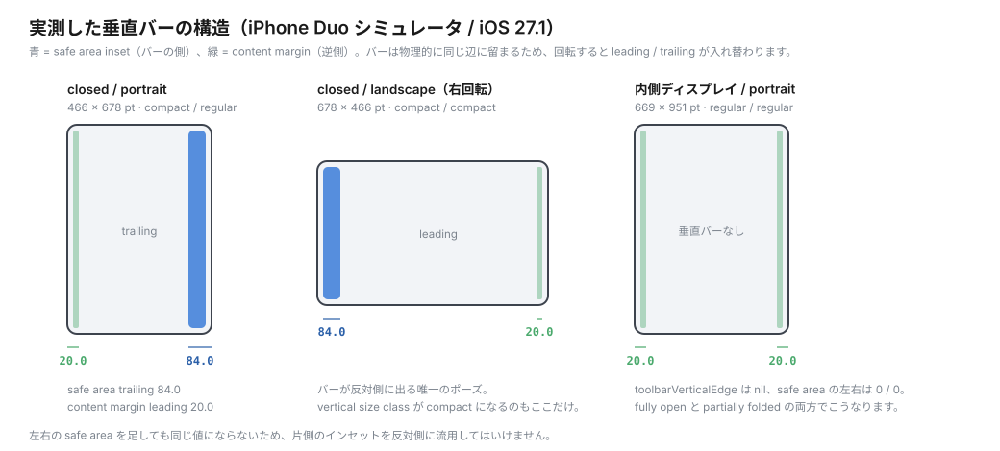

# 検証メモ

iPhone Duo シミュレータ（iOS 27.1）と Xcode 27.1 Beta で実際に確かめた内容です。

## ディスプレイの実測値

`xcrun simctl io <udid> enumerate` で得たピクセル値です。

| ディスプレイ | 解像度 (px) | 縦横比 |
| --- | --- | --- |
| 内側 | 2007 × 2853 | 0.703 |
| 外側 | 1398 × 2034 | 0.687 |

従来の iPhone（おおむね 0.46 前後）と比べると、どちらも正方形に近い比率です。「外側ディスプレイは従来より横長」という記述は、この数値と一致します。

シミュレータには Display のポートが複数見えます。そのうち、1398 × 2034 が外側、2007 × 2853 が内側で、スクリーンショットは撮り分けられます。

```sh
xcrun simctl io <udid> enumerate                      # ポートと UUID の一覧
xcrun simctl io <udid> screenshot --display <UUID> out.png
```

`--display` を省略すると内側が既定になります。閉じた状態では内側が消灯しているため、既定のまま撮ると真っ黒な画像になります。

## 外側ディスプレイのホーム画面

閉じた状態のホーム画面では、時計や Wi-Fi といったステータス要素が画面右側に縦に並びます。Safari のアイコンは右端、検索ボタンは右下に寄っていました。「コントロールが側面へ寄る」という原則が、システム UI にそのまま現れています。

## 落とし穴: SourceKit が新 API を認識しない

Xcode 27.1 Beta でも、エディタ（SourceKit）に次のようなエラーが出ることがあります。

```
Cannot find type 'DeviceHinge' in scope
Value of type 'GeometryProxy' has no member 'reservedRegions'
Value of type 'some View' has no member 'toolbarVerticalBehavior'
'navigationBarTitleDisplayMode' is unavailable in macOS
```

これらはすべて誤検知でした。同じコードが `swiftc -typecheck` でも `xcodebuild` でも警告なしで通ります。

```sh
SDK="/Applications/Xcode-27.1.0-Beta.app/Contents/Developer/Platforms/iPhoneSimulator.platform/Developer/SDKs/iPhoneSimulator.sdk"
swiftc -typecheck -sdk "$SDK" -target arm64-apple-ios27.1-simulator YourFile.swift
```

エディタの赤線を見て API の存在を疑う前に、上のコマンドで確かめてください。マルチプラットフォームテンプレートから作った場合、`SUPPORTED_PLATFORMS` に macOS が残っていると、SourceKit が macOS として評価します。iOS 専用に絞っておくと誤検知が減ります。

## API の所在

`ArrangementView`、`reservedRegions`、`onHingeChange` は、`SwiftUI` ではなく `SwiftUICore` モジュールに定義されています。`SwiftUI` が再エクスポートするので、利用側は `import SwiftUI` だけで足ります。SDK を grep して存在を確かめるときは、`SwiftUICore.framework` 側を見てください。

```sh
SDK="/Applications/Xcode-27.1.0-Beta.app/Contents/Developer/Platforms/iPhoneOS.platform/Developer/SDKs/iPhoneOS.sdk"
grep -n "ArrangementView" \
  "$SDK/System/Library/Frameworks/SwiftUICore.framework/Modules/SwiftUICore.swiftmodule/arm64e-apple-ios.swiftinterface"
```

## ポーズの切り替え方

Xcode 27 のバンドルに `Simulator.app` はありません。`DeviceHub.app` に置き換わっています。

```
/Applications/Xcode-27.1.0-Beta.app/Contents/Applications/DeviceHub.app
```

旧 Xcode の `Simulator.app` が同時に起動していると、どちらのウィンドウを操作しているのか紛らわしくなります。DeviceHub にはデバイス一覧のウィンドウもあります。姿勢のボタンがあるのは、デバイスの画面を表示しているウィンドウです。

**別の Xcode で作業しながら 27.1 を使う場合**は、`xcode-select` を切り替えず、コマンドごとに `DEVELOPER_DIR` を指定します。別の作業の Xcode に影響しません。

```sh
export DEVELOPER_DIR=/Applications/Xcode-27.1.0-Beta.app/Contents/Developer
xcodebuild -project iPhoneDuoLab.xcodeproj -scheme iPhoneDuoLab \
  -destination "id=<iPhone Duo の UDID>" -derivedDataPath /tmp/duolab-dd build
xcrun simctl install <UDID> /tmp/duolab-dd/Build/Products/Debug-iphonesimulator/iPhoneDuoLab.app
```

DeviceHub で、すでに別のシミュレータを表示しているウィンドウがあるときは、そのウィンドウの表示を切り替えないでください。`File > New Window` で新しいウィンドウを開き、サイドバーで iPhone Duo を選びます。

### 姿勢は下部バーのボタンで変える

デバイスウィンドウの下部バーには、左から次のボタンがあります。

| ボタン | 役割 |
| --- | --- |
| グリッド | アプリの切り替え |
| カメラ | スクリーンショット |
| 丸 | 録画 |
| **回転** | 画面の向きを変える |
| **電話型** | closed（閉じる） |
| **本型** | partial（部分的に折る） |
| **平らな画面** | open（完全に開く） |

3 つの姿勢ボタンで作れる姿勢と、そのときのヒンジの値です。

| ボタン | ヒンジの状態 | 角度 |
| --- | --- | --- |
| 電話型 | closed | 0.0° |
| 本型 | partiallyOpen | 約 128°（127.5〜128.0°） |
| 平らな画面 | fullyOpen | 180.0° |

- 以前のこの文書の記録には、0〜180 度のスライダーがあるとありました。この DeviceHub（Xcode 27.1 Beta 27A9269）の下部バーには、スライダーが見当たりません
- 以前の記録では、下部バーの 4 番目のボタンを Enter Resize Mode としていました。この環境では、4 番目のボタンを押すと、画面の向きが 90° 回りました
- そのため、角度を途中で止めることはできません。ボタンを押すと、角度が遷移のアニメーションで動き、途中の値が `onHingeChange` に届きます（[02-api-reference.md](02-api-reference.md) の「実測: 通知の中身と、状態が切り替わる角度」）
- メニューに姿勢を変える項目はありません。Controls メニューにあるのは Home / Lock / Siri / App Switcher / Action Button / Screenshot / Record Screen だけです。`simctl` にも該当する手段はありません
- シミュレータで再現できないのは、内側と外側を同時に点灯させる状態と、カメラが動作している状態です（カメラが 1 台もないため）

姿勢ボタンと回転ボタンは、座標を指定したクリックで押せます。バックグラウンドのクリックは、ウィンドウの一部が Dock などに隠れているとき、拒否されます。その場合は、ウィンドウを前面に出して押します。

### 回転ボタンは 4 つの向きを通る

回転ボタンを押すたびに、画面の向きが 90° ずつ変わり、4 回で一周します。**上下が逆になった向きも通ります。**

押したときの向きの移り変わりを記録しました。

| 押す前 | 押した後 |
| --- | --- |
| 上下が逆の portrait（バーが左、文字が逆さまに見える） | landscape（バーが左） |
| landscape（バーが左） | portrait（バーが右。通常の向き） |
| portrait（バーが右。通常の向き） | landscape（バーが右） |

3 つは直接確かめた移り変わりです。残る「landscape（バーが右）→ 上下が逆の portrait」は、4 回で一周することからの推定で、直接は見ていません。

- **どの向きにいるかは、値で確かめてください。** closed では `verticalBarEdge`（portrait でバーが右なら通常の向き、左なら上下が逆）、内側ディスプレイでは内側カメラの領域の位置（[02-api-reference.md](02-api-reference.md) の「端末の向きによる違い」）が目印になります
- `simctl io screenshot` で撮った画像は、上下が逆の向きで撮っても、文字が読める向きで保存されます。**画像の見た目だけでは、撮った向きが分かりません**
- 姿勢ボタンを押した直後の向きは、直前の向きで決まります。毎回同じ向きになるとは限りません
- 測定や撮影の前に、向きを確かめる習慣をつけてください。測定のあとは、通常の向き（closed / portrait でバーが右）に戻しておきます

### 自動操作するときの注意

- 内側ディスプレイにはタッチが届きません（以前の記録）。開いた状態では tap も scroll も成功を返しますが、何も起きません。回避策は、起動引数で目的の画面を直接開くことです（下の「測定の方法」）
- `simctl io <udid> enumerate` のディスプレイ UUID は、姿勢が変わるたびに変わることがあります。スクリーンショットのたびに引き直してください
- 閉じた状態では内側ディスプレイが消灯しているので、`screenshot` を `--display` 指定なしで撮ると、真っ黒な画像になります
- 同じシミュレータを、複数のセッションで同時に操作しないでください。ディスプレイ UUID が勝手に変わっていたら、誰かが端末を折っています
- sim-use は内側ディスプレイで向きを誤判定します（"assuming portrait"）。`Group` 要素の w×h が正しい向きです

### 画面のテキストで値を読む

DeviceHub の AX ツリーには、シミュレータ内で動いているアプリの要素がそのまま現れます。`AXStaticText` の description にアプリが表示しているテキストが入るので、画像を読まずに値を取れます。

```
AXStaticText desc=867 × 553
AXStaticText desc=regular / regular
AXStaticText desc=T 82  B 34
```

ただし、アプリの AX ツリーは大きく、取得に時間がかかります。**この文書の測定では、代わりに Lab がアプリのコンテナへ JSON を書き出し、`simctl get_app_container` で読む方法を使いました**（下の「測定の方法」）。

## 測定の方法

### 使った Lab と起動引数

すべての Lab は `-lab <名前>` で直接開けます。内側ディスプレイにはタッチが届かないので、起動引数で目的の画面を出しておきます。

| Lab | `-lab` | 何を測るか | 追加の起動引数 |
| --- | --- | --- | --- |
| `APIValuesLab` | `apiValues` | SwiftUI の値（safe area、`contentMargins`、予約領域、ヒンジ） | `-hingeNoState 1`（通知で `@State` を更新しない） |
| `UIKitValuesLab` | `uikitValues` | UIKit の値（`layoutMargins`、`LayoutRegion`、予約領域、`UIHingeInteraction`） | |
| `MarginProbeLab` | `marginProbe` | `View.contentMargins` の効果 | `-probeMode 0〜12` |
| `ArrangementViewLab` | `arrangement` | ペインの位置 | `-arrStyle automatic|split|overlay`、`-arrAxis vertical|horizontal`、`-arrClean 1`、`-arrOpaque 1`、`-arrEdge top|bottom|leading|trailing`、`-arrEdgeOn secondary|primary|container` |
| `ToolbarLab` | `toolbar` | 項目の移り方 | `-toolbarDisabled 0|1`、`-toolbarPinned 0|1` |
| `SheetLab` | `sheet` | シートの大きさと位置 | `-sheet plain|nav|wide|alert|place-automatic|place-leading|place-center|place-trailing` |
| `ReservedRegionsLab` | `reservedRegions` | 予約領域の可視化 | `-regionsInactive 0|1` |
| `WebViewLab` | `webView` | WebView の safe area | `-webMode 0〜4` |
| `CameraProbeLab` | `cameraProbe` | シミュレータでのカメラの有無 | `-camera inner|outer` |
| `CameraSplitLab` | `cameraSplit` | 内側カメラを使う app と使わない app が並んだときの `isActive`（実機用。手順は [08-camera-split-check.md](08-camera-split-check.md)） | `-cameraSplitRole camera|observer`、`-cameraSplitAutoStart 1` |

**`-annot 1`** を付けると、どの Lab の上にも safe area（赤）・`contentMargins`（青）・予約領域（灰と赤紫）が数字つきで重なります。docs の「印つき」の画像は、これで撮りました（`Labs/Annotation.swift`）。

`-lab` を付けて起動した Lab は、値を `Documents/api-values.json` に書き出します。

```sh
DATA=$(xcrun simctl get_app_container <UDID> com.kusumotoa.iPhoneDuoLab data)
xcrun simctl launch <UDID> com.kusumotoa.iPhoneDuoLab -lab apiValues
sleep 3
cat "$DATA/Documents/api-values.json"
```

### 測定に使ったスクリプト

`tools/measure/` に、測定に使ったスクリプトを置いてあります。`DEVELOPER_DIR` には 27.1 を、iPhone Duo の UDID には、見つかったシミュレータを自動で使います（環境変数 `DUO_UDID` で上書きできます）。

| スクリプト | 役割 |
| --- | --- |
| `read-lab.sh <名前> [引数...]` | Lab を起動し、書き出された JSON を表示する |
| `orient.sh` | 現在の姿勢と向きを出す。測定や撮影の前に使う |
| `shot.sh <出力パス>` | 内側・外側の両ディスプレイを撮る |
| `bbox.py <画像> <色>` | 指定した色の外接矩形を、pt で出す（`uv run --with pillow --with numpy` で実行） |

```sh
cd tools/measure
./orient.sh                                   # 向きを確かめる
./read-lab.sh apiValues                       # SwiftUI の値
./read-lab.sh sheet -sheet place-trailing     # 起動引数つき
```

### 位置は frame ではなく、画像の画素で測る

**`onGeometryChange` で読んだ frame は、`.ignoresSafeArea()` や `.contentMargins(for:)` による見た目の変化を反映しません。** たとえば、x 20–867 に描かれたビューの frame が、`0–867` と報告されました。最初に frame で測ったときは、修飾子が効いていないように見えました。

ビューの位置を測るときは、そのビューに固有の色を付けて、スクリーンショットの画素から外接矩形を求めます。この文書の `ArrangementView`、`contentMargins`、シートの位置は、この方法で測りました。単位は、画像のピクセルを 3 で割った pt です。

### WebView の測定

WebKit の初回の起動には、3〜6 秒かかりました。起動して 3 秒後に読むと、ページの値が空でした。7 秒待つと安定しました。

## 6 つのポーズでの実測値

`PoseInspectorLab` と `APIValuesLab` で読んだ値です。姿勢の呼び方と、基本の値は、[02-api-reference.md](02-api-reference.md) の「実測の前提と読み方」にまとめてあります。

### ディスプレイ諸元

| | ピクセル | ポイント | scale |
| --- | --- | --- | --- |
| 外側 | 1398 × 2034 | **466 × 678** | 3x |
| 内側 | 2007 × 2853 | **669 × 951** | 3x |

### size class と画面サイズ

| ポーズ | 画面 (pt) | horizontal | vertical |
| --- | --- | --- | --- |
| closed / portrait | 466 × 678 | compact | regular |
| closed / landscape | 678 × 466 | compact | **compact** |
| fully open / portrait | 669 × 951 | regular | regular |
| fully open / landscape | 951 × 669 | regular | regular |
| partially folded / portrait | 669 × 951 | regular | regular |
| partially folded / landscape | 951 × 669 | regular | regular |

vertical が compact になるのは closed / landscape だけです。内側は向きによらず regular / regular で、記事の記述と一致しました。

### safe area・content margins・バーの位置

単位は pt、順に top / bottom / leading / trailing です。

| ポーズ | safe area | content margins | toolbarVerticalEdge |
| --- | --- | --- | --- |
| closed / portrait | 82 / 34 / 0 / **84** | 0 / 0 / **20** / 0 | **trailing** |
| closed / landscape（バーが右） | 82 / 34 / 0 / **84** | 0 / 0 / **20** / 0 | **trailing** |
| closed / landscape（バーが左） | 82 / 34 / **84** / 0 | 0 / 0 / 0 / **20** | **leading** |
| fully open / portrait | 82 / 34 / 0 / 0 | 0 / 0 / 20 / 20 | **nil（水平バー）** |
| fully open / landscape | 82 / 34 / 0 / **84** | 0 / 0 / 20 / 0 | **trailing** |
| partially folded / portrait | 82 / 34 / 0 / 0 | 0 / 0 / 20 / 20 | **nil（水平バー）** |
| partially folded / landscape | 82 / 34 / 0 / **84** | 0 / 0 / 20 / 0 | **trailing** |



### ヒンジと予約領域

| ポーズ | hinge status | angle | division（アクティブ） | occlusion（アクティブ） |
| --- | --- | --- | --- | --- |
| closed | closed | 0.0° | 0 | 2 |
| fully open | fullyOpen | 180.0° | 0（非アクティブが 1） | 1（非アクティブが 1） |
| partially folded | partiallyOpen | 約 128°（127.5〜128.0°） | **1** | 1（非アクティブが 1） |

件数と、status・角度は、向き（portrait / landscape）で変わりません。アクティブな `.occlusion` の大きさは、向きで変わります（portrait では 134×82、landscape では 84×120）。領域の位置と大きさは、[02-api-reference.md](02-api-reference.md) の「実測: 領域の位置と margins」にあります。

### 読み取れたこと

- 垂直バーの幅は 84.0 pt です。safe area がバー側に 84.0、content margins が逆側に 20.0 という構造で、左右を足しても常に同じ値にはなりません。「片側の値を反対側に流用しない」という指針が、数値で裏付けられました
- 内側ディスプレイの portrait では垂直バーが出ません（`toolbarVerticalEdge` が nil、safe area の左右が 0 / 0）。記事にあった例外を、実測で確認できました
- closed / landscape には、バーが左に出る向きと右に出る向きがあり、向きで leading / trailing が入れ替わります。`toolbarVerticalEdge` を見ずに trailing 固定で組むと破綻します。内側の landscape では、測った 2 つの向き（内側カメラの領域が上にある向きと下にある向き）の両方で、trailing でした
- `division` は partially folded のときだけアクティブです。fully open では非アクティブとして存在し、closed では存在しません
- `occlusion` は、closed で 2 件（外側のカメラ）がアクティブです。open と partial では、アクティブな 1 件（ステータス表示の領域）と、非アクティブの 1 件（内側カメラ）です
- safe area の top は、大タイトル展開時 82.0 で、スクロールして inline に縮むと 24.0 になります（`GeometryReader` を `List` の外に置いているため、タイトルの状態を拾います）

## 記事と SDK の突き合わせ結果

参照記事は、Apple Developer Documentation の索引（31,243 項目、2026-09-10 取得）と iOS 27.0 SDK で API を照合しています。27.1 向けは、2026-09-17 時点の Beta ドキュメントで再照合しています。この手順のため、27.1 SDK にしかない API は記事の本文に出てきにくくなります。

27.1 SDK を直接調べたところ、記事が「公式サンプルには出るがドキュメント未収載」としていた 3 つは、いずれも実在しました。

- `onHingeChange`
- `toolbarVerticalBehavior(_:)`
- `toolbarVerticalCompressionBehavior(_:)`

記事の本文コード例には出てきませんが、SDK に実在する API として、次も確認しました。

- `splitArrangementLayoutRatio(_:)` / `splitArrangementLayoutRatio(minHorizontal:...)`
- `splitArrangementLayoutSize(minWidth:...)` / `splitArrangementFixedLayoutSize(horizontal:vertical:)`
- `overlayArrangementEdge(_:)` / `EnvironmentValues.overlayArrangementZIndex`
- `ContentMarginGuide` / `PresentationPlacement` / `ConcentricRectangle`
- `AVCaptureDeviceTypeBuiltInOuterUltraWideCamera` / `...InnerUltraWideCamera`（iOS 27.1）
- `UIVerticalBarEdge`（`.unspecified` / `.leading` / `.trailing`、iOS 27.1）
- `UINavigationItem.pinnedTrailingGroup` / `.verticalBarCompressionBehavior` / `.additionalOverflowItems`
- `UIViewController.preferredVerticalBarBehavior`
- `UIBarButtonItemVisibilityPriority` / `UIBarButtonItem.creatingFixedGroup()`
- `UISheetPresentationController.preferredPlacement`
