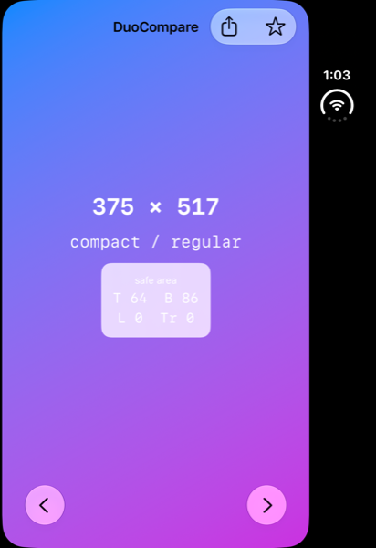
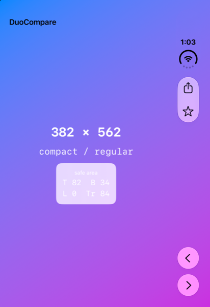
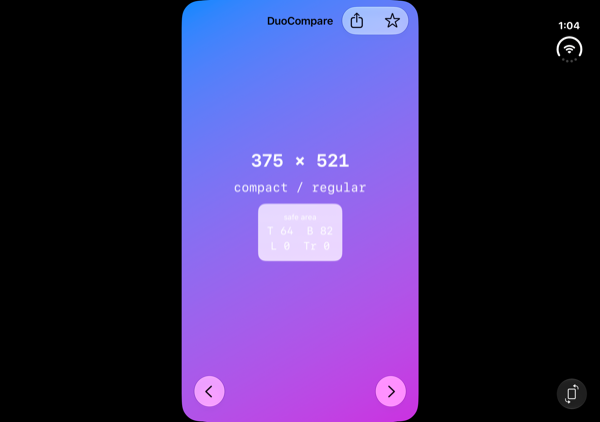
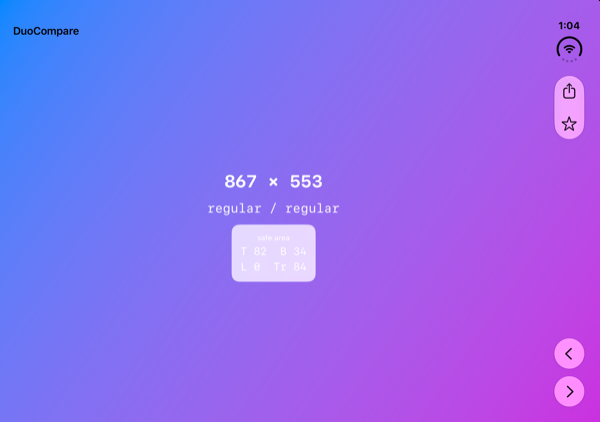
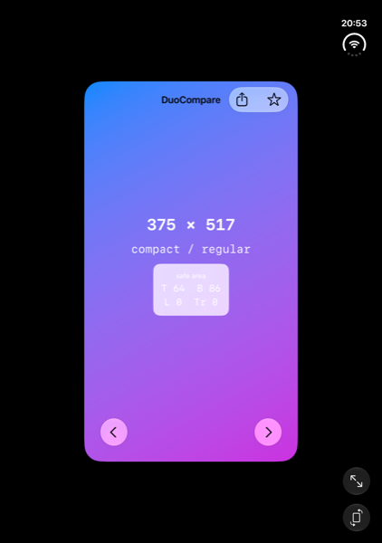
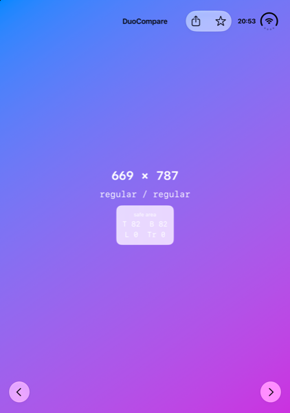

# 対応する / しないで何が変わるか

同じソースコードを **iOS 26 SDK** と **iOS 27.1 SDK** でビルドし、iPhone Duo シミュレータ（iOS 27.1）で並べたものです。**変えたのは SDK だけ**で、コードは 1 文字も違いません。

比較用アプリは `NavigationStack` + ツールバー + 画面全体を塗るグラデーションという最小構成です。背景を端まで塗っているので、黒帯が残っているかが一目で分かります。

3 つの姿勢で撮っています。**差がいちばん大きいのは折った状態**です。

## 外側ディスプレイ（closed / portrait）

| 対応しない（iOS 26 SDK） | 対応する（iOS 27.1 SDK） |
| --- | --- |
|  |  |
| **375 × 517 pt** | **382 × 562 pt** |
| safe area T 64 / B 86 / L 0 / **Tr 0** | safe area T 82 / B 34 / L 0 / **Tr 84** |
| ツールバーが**上部に水平配置** | ツールバーが**右辺に垂直配置** |
| 右側に黒帯。ステータスバーはその黒帯の中 | 全画面。ステータスバーも右辺に縦並び |

閉じた状態では差が構造的に出ます。左は `Tr 0` なので**垂直バーが存在せず**、ツールバーは従来どおり画面上部に横並びです。その結果、右側が丸ごと黒帯になります。右は `Tr 84` で、共有・星のボタンが右辺に縦に並び、時刻と Wi-Fi もそこに入ります。

## 内側ディスプレイ（partially folded / landscape）

| 対応しない（iOS 26 SDK） | 対応する（iOS 27.1 SDK） |
| --- | --- |
|  |  |
| **375 × 521 pt** | **867 × 553 pt** |
| compact / regular | **regular / regular** |
| safe area T 64 / B 82 / L 0 / Tr 0 | safe area T 82 / B 34 / L 0 / **Tr 84** |
| 中央に縦長の窓、左右に巨大な黒帯 | 全画面 |

折った状態がいちばん差が開きます。内側ディスプレイは横向きで 951 × 669 pt ありますが、左は 375 × 521 pt しか使えていません。**面積比でおよそ 3 分の 1 以下**です。

## 内側ディスプレイ（fully open / portrait）

| 対応しない（iOS 26 SDK） | 対応する（iOS 27.1 SDK） |
| --- | --- |
|  |  |
| **375 × 517 pt** | **669 × 787 pt** |
| size class **compact / regular** | size class **regular / regular** |
| safe area T 64 / B 86 / L 0 / Tr 0 | safe area T 82 / B 82 / L 0 / Tr 0 |
| 四方が黒帯。右下にシステムの拡大・回転ボタンが出る | 全画面。ツールバーが画面上端に収まる |

左は**互換モードの窓に閉じ込められています**。画面は 669 × 951 pt あるのに、アプリが受け取るのは 375 × 517 pt だけです。375 pt は従来の iPhone の幅で、システムが「このアプリは大きい画面を知らない」と判断して従来サイズのキャンバスを与えている状態です。

重要なのは**サイズだけでなく size class も変わる**点です。左では内側ディスプレイなのに `compact / regular` のままなので、`horizontalSizeClass == .regular` で分岐を書いていても**その分岐に入りません**。2 列レイアウトを用意していても発動しない、ということです。

## 何をすれば右になるか

このアプリは Duo 向けの API を 1 つも使っていません。**iOS 27.1 SDK でビルドし直しただけ**です。

つまり最初の一歩は API の追加ではなく、ビルド環境の更新です。そのうえで、

1. size class で分岐する（`regular` が実際に来るようになる）
2. safe area の 4 辺を個別に扱う（垂直バーで左右が非対称になる）
3. 標準コンポーネントを使う（ツールバーが自動で側面に移る）

という順で進めます。詳細は [99-checklist.md](99-checklist.md) を参照してください。

## 注意

iOS 27 SDK でリンクした時点でリサイズ対応が有効になります。**Xcode 27 でビルドしつつ従来の表示のまま据え置く方法はない**と回答されています。SDK を上げるなら、レイアウトの見直しもセットで必要です。

## 再現方法

比較用アプリのソースは [`tools/DuoCompare`](../tools/DuoCompare) にあります。Xcode プロジェクトを使わず、`swiftc` で直接ビルドして `.app` バンドルを組み立てています。Xcode 27 が作るプロジェクト（`objectVersion = 110`）は Xcode 26 が読めないため、同じソースを 2 つの SDK でビルドするにはこの方法が必要でした。

```sh
cd tools/DuoCompare
./build.sh Xcode-26.6.0.app   26  26.0
./build.sh Xcode-27.1.0-Beta.app 271 27.1

UDID=<iPhone Duo シミュレータの UDID>
xcrun simctl install $UDID DuoCompare26.app
xcrun simctl install $UDID DuoCompare271.app
xcrun simctl launch $UDID com.kusumotoa.compare.DuoCompare26
```

`Info.plist` は両方とも同じ内容（`UILaunchScreen` を含む）で、違うのは `MinimumOSVersion` と SDK 情報だけです。ビルドされたバイナリは `vtool -show-build` で記録された SDK バージョンを確認できます。
