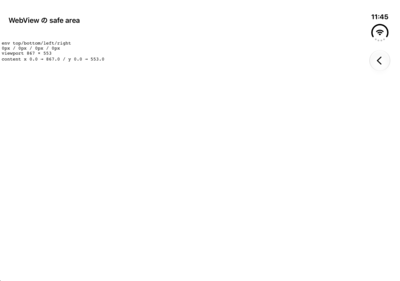
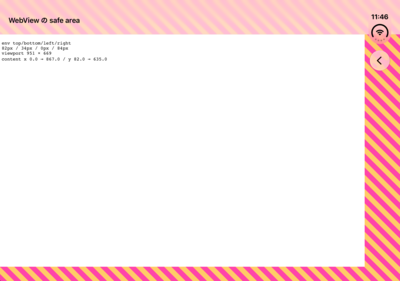
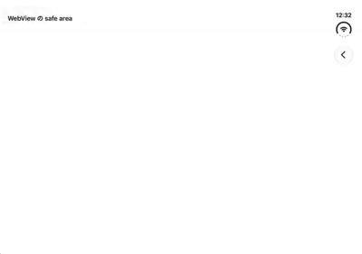

# WebView に表示するページの safe area

WebView の中のページも、iPhone Duo では safe area を考える必要があります。垂直バーが画面の側面を取るため、ページの内容がバーの下に潜ることがあるからです。

対応の方法は 2 つあります。

| | 方法 | ページ側で必要なこと |
| --- | --- | --- |
| A | **WebView を safe area の内側に置く** | 何もしない |
| B | **WebView を画面全体へ広げ、ページの CSS で避ける** | `viewport-fit=cover` と `env(safe-area-inset-*)` |

余白を取りたいだけなら、A で足ります。ページの背景を、バーの裏まで広げたいときは B を選びます。

## 測定の条件

`WKWebView` に同じ HTML を表示し、ページの中から `env(safe-area-inset-*)` の値と、本文の枠の位置を読みました。iPhone Duo シミュレータ（iOS 27.1）での実測で、実機では確認していません。測定に使った Lab は `WebViewLab` です。

safe area の値（姿勢ごと）は [02-api-reference.md](02-api-reference.md) の「6 姿勢の基本値」を参照してください。

## A: WebView を safe area の内側に置く

SwiftUI では、何も指定しなければ、この置き方になります。UIKit では、WebView の制約を `view.safeAreaLayoutGuide` に結びます。

```swift
// SwiftUI: WebView をそのまま置く（safe area の内側に収まる）
WebViewRepresentable()

// UIKit: safeAreaLayoutGuide に結ぶ
NSLayoutConstraint.activate([
    webView.leadingAnchor.constraint(equalTo: view.safeAreaLayoutGuide.leadingAnchor),
    webView.trailingAnchor.constraint(equalTo: view.safeAreaLayoutGuide.trailingAnchor),
    webView.topAnchor.constraint(equalTo: view.safeAreaLayoutGuide.topAnchor),
    webView.bottomAnchor.constraint(equalTo: view.safeAreaLayoutGuide.bottomAnchor),
])
```

実測では、ページの `env(safe-area-inset-*)` は、全姿勢で `0px` でした。WebView 自身が safe area の内側にあるので、ページが避ける必要のある領域が、そもそもありません。

| 姿勢 | ページの表示領域（`window.innerWidth × innerHeight`） |
| --- | --- |
| closed / portrait | 382 × 562 |
| closed / landscape | 594 × 350 |
| open / portrait | 669 × 835 |
| open / landscape | 867 × 553 |
| partial / portrait | 669 × 835 |
| partial / landscape | 867 × 553 |

ページの背景は、WebView の外側（safe area の外）には広がりません。バーの裏まで色を敷きたいときは、WebView の背後に、別の View で背景を敷きます。

## B: WebView を広げて、CSS で避ける

WebView を画面全体へ広げ（SwiftUI は `.ignoresSafeArea()`）、ページに 2 つを書きます。

```html
<!-- 1. viewport-fit=cover を指定する -->
<meta name="viewport" content="width=device-width, initial-scale=1, viewport-fit=cover">
```

```css
/* 2. env() の値を padding にして、内容を safe area の内側へ寄せる */
body {
  padding: env(safe-area-inset-top) env(safe-area-inset-right)
           env(safe-area-inset-bottom) env(safe-area-inset-left);
}
```

**1 と 2 は、セットです。** どちらか一方だけでは、うまくいきません（下の「落とし穴」）。

`env()` の値は、姿勢で変わります。実測値です。単位は px で、**top / bottom / left / right** の順です（CSS の `padding` の指定順とは違います）。

| 姿勢 | `env(safe-area-inset-*)` | ページの表示領域 | 本文の枠（画面の左上が原点） |
| --- | --- | --- | --- |
| closed / portrait | 82 / 34 / 0 / **84** | 466 × 678 | x 0–382、y 82–644 |
| closed / landscape（バーが右） | 82 / 34 / 0 / **84** | 678 × 466 | x 0–594、y 82–432 |
| closed / landscape（バーが左） | 82 / 34 / **84** / 0 | 678 × 466 | x 84–678、y 82–432 |
| open / portrait | 82 / 34 / 0 / 0 | 669 × 951 | x 0–669、y 82–917 |
| open / landscape | 82 / 34 / 0 / **84** | 951 × 669 | x 0–867、y 82–635 |
| partial / portrait | 82 / 34 / 0 / 0 | 669 × 951 | x 0–669、y 82–917 |
| partial / landscape | 82 / 34 / 0 / **84** | 951 × 669 | x 0–867、y 82–635 |

- 値は、ネイティブの `safeAreaInsets` と同じです（[02-api-reference.md](02-api-reference.md)）
- ページの表示領域は、画面全体の大きさになります。本文の枠は、`env()` の分だけ内側に寄ります
- **左右は非対称です。** バーがある辺だけ 84 になります。closed / landscape では、端末を回す向きで、left と right が入れ替わります。左右を同じ値と仮定しないでください

## 4 つの置き方の比較

同じ HTML を、置き方を変えて表示しました。closed / portrait（バーが右）と、open / landscape（バーが右）の結果です。

| 置き方 | `env(safe-area-inset-*)` | ページの表示領域 | ネイティブの `adjustedContentInset` | 内容の位置 |
| --- | --- | --- | --- | --- |
| 0. safe area の内側に置く | 0 / 0 / 0 / 0 | closed 382 × 562、open 867 × 553 | 0 / 0 / 0 / 0 | WebView の中に収まる |
| 1. 広げる（`viewport-fit` 既定） | **0 / 0 / 0 / 0** | closed 382 × 596、open 867 × 587 | **82 / 34 / 0 / 84** | スクロールビューが自動で内側へ寄せる |
| 2. 広げる + `viewport-fit=cover` | **82 / 34 / 0 / 84** | closed 466 × 678、open 951 × 669 | **0 / 0 / 0 / 0** | ページが `env()` で内側へ寄せる |
| 3. 2 + `contentInsetAdjustmentBehavior = .never` | 82 / 34 / 0 / 84 | 2 と同じ | 0 / 0 / 0 / 0 | 2 と同じ |
| 4. 広げる + `viewport-fit` 既定 + `.never` | 0 / 0 / 0 / 0 | closed 466 × 678、open 951 × 669 | 0 / 0 / 0 / 0 | **画面全体に広がり、バーの下に潜る** |

| 0. 内側に置く | 1. 広げる（既定） | 2. 広げる + `cover` | 4. 広げる + `.never` |
| --- | --- | --- | --- |
|  |  |  |  |

画像は open / landscape です。ピンクと黄色の縞模様が、ページの背景（`body`）です。2 では、上・右・下の safe area の裏まで縞模様が広がり、白い本文が `env()` の分だけ内側に寄っています。0 と 1 では、本文が全面に見えていて、縞模様は見えません。

## 落とし穴

- **WebView を広げただけでは、`env()` は 0 のままです（置き方 1）。** ページに `env()` を書いても効きません。その代わり、WebView のスクロールビューが `adjustedContentInset`（82 / 34 / 0 / 84）を自動で足して、内容を safe area の内側に寄せます。一見うまく動きますが、ページの背景はバーの裏まで届きません
- **`viewport-fit=cover` を足すと、ネイティブの自動調整が止まります（置き方 2）。** `adjustedContentInset` が 0 になり、ページが自分で避ける責任を負います。`env()` を使わないと、内容がバーの下に潜ります。読み出した `scrollView.contentInsetAdjustmentBehavior` の値は、既定（置き方 0 と 1）が `.always`（3）で、`viewport-fit=cover` を指定すると `.never`（2）になっていました。**コードで `.never` にしなくても、`cover` を指定した時点で、WebKit が切り替えています**
- **自動調整だけを切っても、`env()` は増えません（置き方 4）。** `contentInsetAdjustmentBehavior = .never` だけにすると、`env()` は 0 のまま、内容が画面全体に広がって、バーの下に潜ります
- `contentInsetAdjustmentBehavior = .never` は、`viewport-fit=cover` があるときは、結果が変わりませんでした（置き方 2 と 3 が同じ）。上のとおり、`cover` で WebKit がすでに `.never` にしているためです。この Lab では、`.never` を足した効果を、独立には確かめられていません
- WebView の初回の表示には、3〜6 秒かかりました。測定するときは、起動してから十分に待ってください

## ネイティブの余白（20pt）に合わせたい場合

UIKit の `layoutMargins` は、safe area に、水平方向の 20pt を足した値でした（[02-api-reference.md](02-api-reference.md) の `ContentMarginGuide` の節）。ただし、バーがある辺には、20pt は足されません。

`env()` だけでは、バーの有無で 20pt を足すかどうかを決められません。次のように書くと、実測した全姿勢の `layoutMargins` の水平方向と、同じ値になります。

```css
body {
  padding-top: env(safe-area-inset-top);
  padding-bottom: env(safe-area-inset-bottom);
  padding-left: max(env(safe-area-inset-left), 20px);
  padding-right: max(env(safe-area-inset-right), 20px);
}
```

バーのある辺は `max(84px, 20px)` で 84px に、バーのない辺は `max(0px, 20px)` で 20px になります。**この書き方は、実測した値から計算した結果です。WebView で表示して確かめてはいません。**

## この Lab で確かめていないこと

- `position: fixed` の要素（下端に固定したボタンなど）は、`bottom: env(safe-area-inset-bottom)` のように、`env()` を足す必要があると考えられます。この Lab では確かめていません
- 端末を折る・回すときの、`env()` の値の追従。姿勢を変えるたびに、ページを読み込み直して測っています
- 実機での挙動
