# WebView に表示するページの safe area

垂直バーが側面を取るので、WebView の中のページも、内容がバーの下に潜ることがあります。対応は 2 つです。

| | 方法 | ページ側で必要なこと |
| --- | --- | --- |
| A | **WebView を safe area の内側に置く** | 何もしない |
| B | **WebView を画面全体へ広げ、CSS で避ける** | `viewport-fit=cover` と `env(safe-area-inset-*)` |

余白を取りたいだけなら A。背景をバーの裏まで広げたいなら B です。シミュレータ（iOS 27.1）の実測で、実機は未確認です。

## 画像の見方

同じ HTML を、置き方を変えて表示しました。**バーの下に潜った部分は、その色が見えなくなります。**

| 色 | 意味 |
| --- | --- |
| 赤の列 | ページの左端 |
| 青の列 | ページの右端 |
| 緑の行 | ページの上端 |
| 橙の行 | ページの下端 |
| ピンクと黄の縞 | ページの背景（`body`） |
| 灰色 | WebView の後ろの背景（WebView がない範囲） |

## 4 つの置き方

| 置き方 | WebView | `viewport-fit` | `contentInsetAdjustmentBehavior` |
| --- | --- | --- | --- |
| **0** | safe area の内側 | 既定 | 既定 |
| **1** | 画面全体へ広げる | 既定 | 既定 |
| **2** | 画面全体へ広げる | `cover` | 既定 |
| **4** | 画面全体へ広げる | 既定 | `.never` |

### closed / portrait（バーが右）

| 0 | 1 | 2 | 4 |
| --- | --- | --- | --- |
| 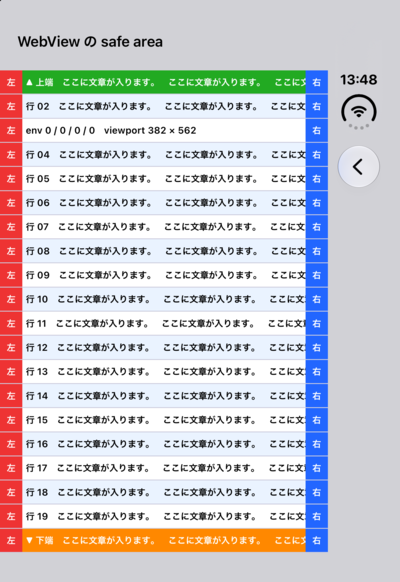 | 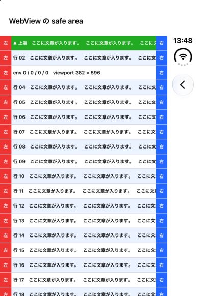 | 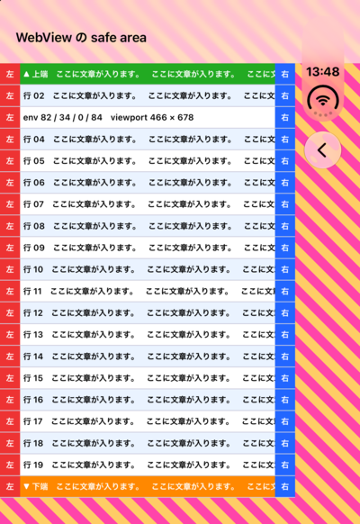 | 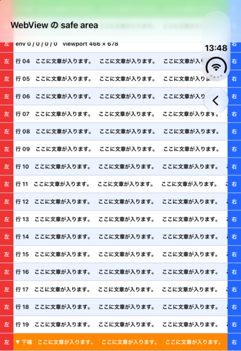 |

### closed / landscape（バーが右）

| 0 | 1 | 2 | 4 |
| --- | --- | --- | --- |
| 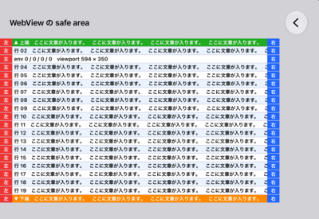 | 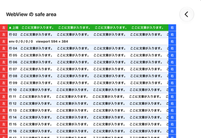 | 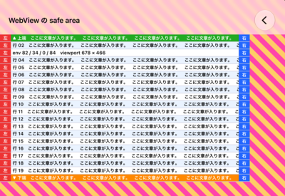 | 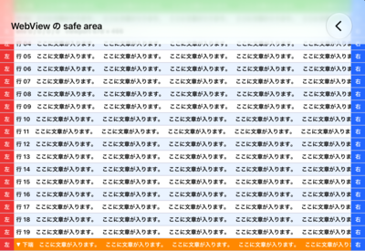 |

### open / portrait（バーなし）

| 0 | 1 | 2 | 4 |
| --- | --- | --- | --- |
| 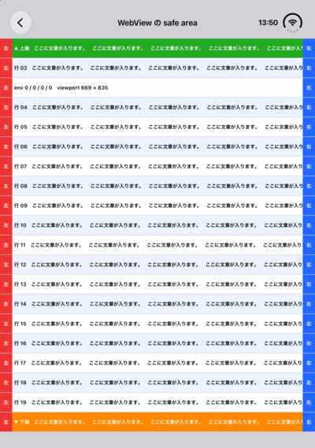 | 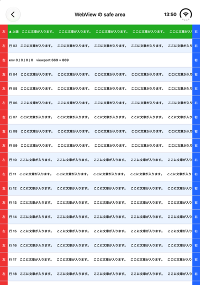 | 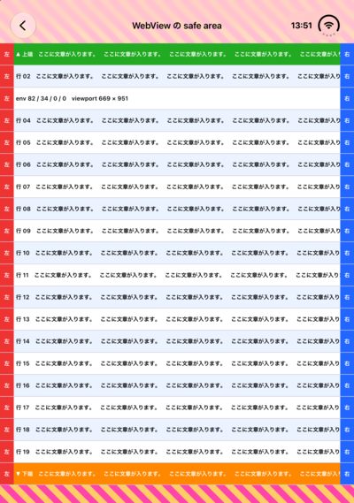 | 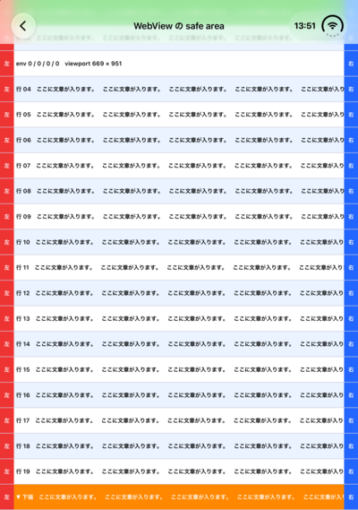 |

### open / landscape（バーが右）

| 0 | 1 | 2 | 4 |
| --- | --- | --- | --- |
| 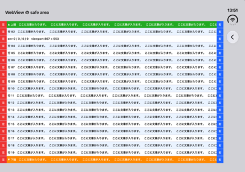 | 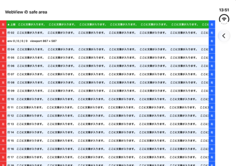 | 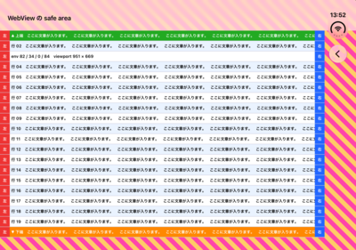 | 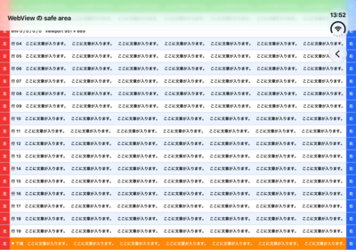 |

- **0**: 内容は WebView の中に収まり、バーの位置は灰色になる。ページ側は何もしなくてよい
- **1**: スクロールビューが内容を自動で内側へ寄せる。背景は、バーの裏まで届かない
- **2**: ページが `env()` の分だけ自分で寄せる。縞模様の背景が、バーの裏まで広がる
- **4**: 自動調整を切っただけ。**上端の緑の行と、右端の青の列が、バーの下に潜る**

## 数値

| 置き方 | `env(safe-area-inset-*)` | `adjustedContentInset` | `contentInsetAdjustmentBehavior` |
| --- | --- | --- | --- |
| 0 | 0 / 0 / 0 / 0 | 0 | `.always` |
| 1 | **0 / 0 / 0 / 0** | **82 / 34 / 0 / 84** | `.always` |
| 2 | **82 / 34 / 0 / 84** | **0** | **`.never`** |
| 4 | 0 / 0 / 0 / 0 | 0 | `.never` |

closed / portrait の値です（top / bottom / left / right、px）。**`viewport-fit=cover` を指定すると、WebKit が `contentInsetAdjustmentBehavior` を `.never` に切り替えます。**

姿勢ごとの `env()` の値（置き方 2）です。

| 姿勢 | `env(safe-area-inset-*)` |
| --- | --- |
| closed / portrait | 82 / 34 / 0 / **84** |
| closed / landscape（バーが右） | 82 / 34 / 0 / **84** |
| closed / landscape（バーが左） | 82 / 34 / **84** / 0 |
| open / portrait、partial / portrait | 82 / 34 / 0 / 0 |
| open / landscape、partial / landscape | 82 / 34 / 0 / **84** |

**左右は非対称です。** バーがある辺だけが 84 で、向きで入れ替わります。

## B の書き方

```html
<meta name="viewport" content="width=device-width, initial-scale=1, viewport-fit=cover">
```

```css
body {
  padding: env(safe-area-inset-top) env(safe-area-inset-right)
           env(safe-area-inset-bottom) env(safe-area-inset-left);
}
```

**2 つはセットです。** `viewport-fit=cover` だけだと内容がバーの下に潜り（置き方 4 と同じ）、`env()` だけだと、広げただけの置き方 1 になって `env()` が 0 のままです。

UIKit の `layoutMargins`（safe area + 水平 20pt。バーのある辺は 20pt を足さない）に揃えるなら、次のとおりです。**値から計算した結果で、WebView では未確認です。**

```css
body {
  padding-top: env(safe-area-inset-top);
  padding-bottom: env(safe-area-inset-bottom);
  padding-left: max(env(safe-area-inset-left), 20px);
  padding-right: max(env(safe-area-inset-right), 20px);
}
```

## 確かめていないこと

- `position: fixed` の要素（下端のボタンなど）。`bottom: env(safe-area-inset-bottom)` が要ると考えられます
- 端末を折る・回すときの、`env()` の追従
- 実機
