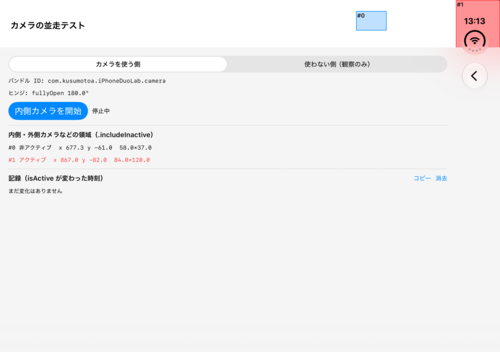

# 実機で確かめる: 内側カメラを使う app と使わない app が並んだとき

内側カメラを使わない app なら、内側カメラの領域を気にしなくてよいのか。**使う app と使わない app が Split View で並んだとき、使わない側にも影響があるのか。** シミュレータにはカメラがなく、確かめられません（[04-camera.md](04-camera.md)）。このページは、実機でこれを、すぐ確かめるための手順です。

## 用意するもの

- iPhone Duo の実機
- Mac と、Xcode 27.1
- 署名に使う Team ID
- このリポジトリ

## 1. 2 つの app を入れる

同じ app を、別々のバンドル ID と表示名で 2 つ入れます。

```sh
cd tools/measure
xcrun devicectl list devices                        # 実機の識別子を調べる
./install-two-apps.sh device <デバイスの識別子> <Team ID>
```

ホーム画面に、次の 2 つが入ります。

| 表示名 | バンドル ID |
| --- | --- |
| Duo カメラ側 | `com.kusumotoa.iPhoneDuoLab.camera` |
| Duo 観察側 | `com.kusumotoa.iPhoneDuoLab.observer` |

初回は、端末の設定で、開発元を信頼する必要があるかもしれません。

## 2. 役割を決める

両方の app で、一覧の「**カメラの並走テスト（実機用）**」を開きます。

| app | 上のスイッチで選ぶ役割 |
| --- | --- |
| Duo カメラ側 | 「カメラを使う側」 |
| Duo 観察側 | 「使わない側（観察のみ）」 |

役割は、app ごとに保存されます。一度選べば、次からは選び直す必要がありません。

## 3. 画面の見方



| 表示 | 意味 |
| --- | --- |
| 赤い枠 | アクティブな領域 |
| 青い枠 | 非アクティブな領域 |
| `#0`、`#1` | 領域の番号。下の一覧と対応します |
| 一覧 | 各領域の、アクティブかどうかと、位置・大きさ |
| 記録 | `isActive` が変わった時刻と、その内容。ミリ秒まで残ります |
| 「コピー」 | 役割・バンドル ID・ヒンジ・記録を、メモに貼れる形でコピーします |
| 「内側カメラを開始」 | 「カメラを使う側」だけに出ます |

内側カメラの領域は、**内側ディスプレイで開いたとき**（open / partial）に現れます。closed では、外側のカメラの領域だけです。

## 4. 確かめる場面

内側ディスプレイで開き、2 つの app を Split View で並べて、順に試します。並べ方は、一方を開いてから、Dock やホーム画面のアイコンを、もう一方の画面の端へドラッグします。

| 場面 | やること | 見るもの |
| --- | --- | --- |
| **A. 基準** | 2 つとも、カメラを開始しない | 両方の app で、内側カメラの領域が**非アクティブ**か |
| **B. 最重要** | 「Duo カメラ側」で「内側カメラを開始」を押す | **「Duo 観察側」の領域が、アクティブに変わるか。** カメラ側自身は変わるか |
| **C. 停止** | 「Duo カメラ側」で「内側カメラを停止」を押す | 観察側の領域が、非アクティブに戻るか。戻るまでの時間 |
| **D. 画面の状態** | カメラを動かしたまま、カメラ側の app を、Split View から外す（ホームへ戻す、など） | カメラが止まったとき、観察側はどうなるか |
| **E. ほかの app** | 「Duo 観察側」だけを開き、ほかの app（標準のカメラ、FaceTime など）で、内側カメラを使う | 別の app のカメラ使用でも、観察側の領域が変わるか |
| **F. 目で見る** | B の状態で、カメラの領域の付近を見る | 画面が暗くなる・欠けるか。範囲が、赤い枠と一致するか |

B の結果が、いちばん知りたいことです。

## 5. 結果の読み方

| B の結果 | 意味 | 取るべき対応 |
| --- | --- | --- |
| 観察側は**変わらない** | 領域のアクティブ状態は、app ごと（カメラを使う app にだけ現れる） | カメラを使わない app は、内側カメラの領域を気にしなくてよい |
| 観察側も**アクティブに変わる** | アクティブ状態は、端末（ディスプレイ）全体のもの | カメラを使わない app でも、領域を避ける必要がある。`reservedRegions` を読んで追従する |
| カメラ側**だけ**アクティブになる | B と同じ意味 | 同上 |
| どちらも変わらない | `isActive` が、カメラの動作と連動していない | 実機で目視（F）して、画面の欠けを確かめる |

## 6. 結果の残し方

各場面のあとで、記録欄の「**コピー**」を押し、メモに貼ります。次の表を埋めて、このページに追記してください。

| 場面 | 端末・OS のビルド | カメラ側の `isActive` | 観察側の `isActive` | 目で見た様子 | 記録の貼り付け |
| --- | --- | --- | --- | --- | --- |
| A | | | | | |
| B | | | | | |
| C | | | | | |
| D | | | | | |
| E | | | | | |
| F | | | | | |

## 詰まったとき

- **「内側カメラが見つかりません」と出る。** シミュレータでは、カメラがないので、必ず出ます。実機で出るときは、内側カメラの `AVCaptureDevice.DeviceType`（`.builtInInnerUltraWideCamera`）が、その端末で使えていません。端末と OS のビルドを控えてください
- **「カメラの許可がありません」と出る。** 設定アプリで、「Duo カメラ側」にカメラを許可してください。バンドル ID ごとに許可が要ります
- **役割を間違えた。** 画面上部のスイッチで、いつでも切り替えられます
- **記録が長くなった。** 「消去」で消せます

## シミュレータで、画面だけ確かめる

カメラは動きませんが、画面の見え方と、記録の仕組みは確かめられます。

```sh
cd tools/measure
./install-two-apps.sh sim
BUNDLE_ID=com.kusumotoa.iPhoneDuoLab.camera ./read-lab.sh cameraSplit -cameraSplitRole camera     # JSON で確認
```

シミュレータで、カメラの許可のダイアログが出て、内側ディスプレイでは押せないときは、`xcrun simctl privacy <UDID> grant camera <バンドル ID>` で、許可を与えます。

## この Lab が見ているもの

`GeometryProxy.reservedRegions(kind: .occlusion, options: [.includeInactive])`（SwiftUI）の、`isActive` と、位置・大きさです。UIKit の `UIView.reservedRegions` は見ていません。SwiftUI と UIKit は、同じ矩形を返すことを確かめてあります（[02-api-reference.md](02-api-reference.md)）が、`isActive` が同じ値になるかは、実機で確かめていません。
